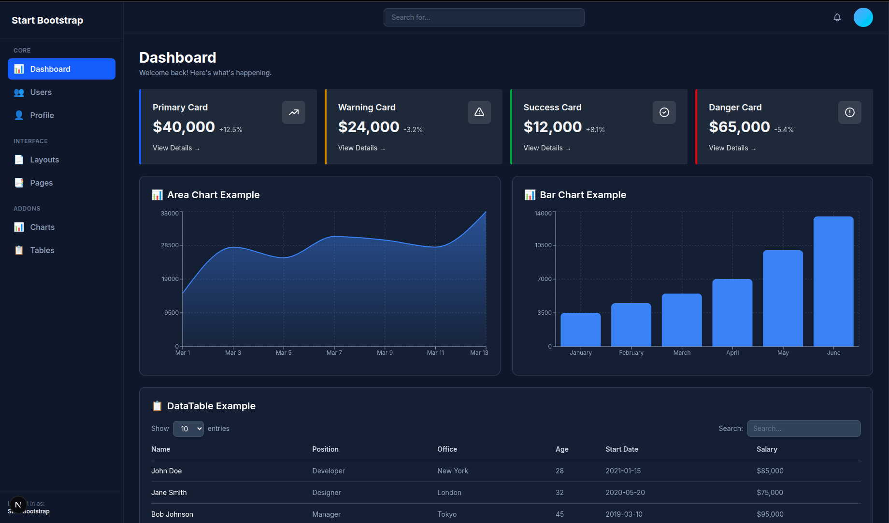

# Day 1 – TailwindCSS + UI System Basics

## 🎯 Objective
Set up TailwindCSS in a Next.js project and build a Dashboard Layout skeleton with a reusable Navbar and Sidebar using utility-first styling.

---

## 📚 Topics Covered

| Topic | Details |
|---|---|
| Tailwind Setup | Installed and configured TailwindCSS in Next.js |
| Utility Classes | Spacing, colors, typography using Tailwind utilities |
| Custom Theme | Extended theme in `tailwind.config.js` |
| Layout Structure | Built header + sidebar dashboard skeleton |

---

## 🧪 Exercise

Built a **Dashboard Layout Skeleton** with:
- 🔝 **Navbar** — Top header bar with branding and nav links
- 📂 **Sidebar** — Left sidebar with navigation menu items

**Reference Image:** [Dashboard Reference](https://assets.startbootstrap.com/img/meta/products/twitter/twitter-image-sb-admin.png)

---

## ✅ Deliverables

- `app/layout.js` — Root layout wrapping Navbar + Sidebar
- `components/ui/Navbar.jsx` — Reusable top navigation bar
- `components/ui/Sidebar.jsx` — Reusable sidebar component

---

## 📸 Screenshots

### 🖥️ Dashboard Layout Skeleton


---

## 🧠 Key Learnings

### TailwindCSS Setup in Next.js
- Installed via `npm install -D tailwindcss postcss autoprefixer`
- Initialized config with `npx tailwindcss init -p`
- Added content paths in `tailwind.config.js` to scan `app/` and `components/`
- Imported Tailwind directives in `globals.css`:
  ```css
  @tailwind base;
  @tailwind components;
  @tailwind utilities;
  ```

### Utility-First Styling
- No custom CSS needed — composed styles directly in JSX using utility classes
- Spacing: `p-4`, `px-6`, `mt-2`, `gap-4`
- Colors: `bg-gray-900`, `text-white`, `border-gray-700`
- Typography: `text-xl`, `font-semibold`, `tracking-wide`

### Custom Theme Configuration
- Extended colors, fonts, and spacing in `tailwind.config.js` under `theme.extend`
- Allows project-specific design tokens while keeping Tailwind defaults

### Layout Architecture
- `app/layout.js` acts as the root shell — renders Navbar + Sidebar on every page
- Navbar and Sidebar are isolated as reusable components in `/components/ui/`
- Used Flexbox (`flex`, `flex-col`, `flex-row`) to structure the dashboard shell

---

## 📁 Folder Structure

```
DAY_1-TailwindCSS_AND_UI System Basics/
├── app/
│   └── layout.js
├── components/
│   └── ui/
│       ├── Navbar.jsx
│       └── Sidebar.jsx
├── Dashboard_Layout_skeleton.png
└── README.md
```

---

## 🚀 How to Run

```bash
# Install dependencies
npm install

# Run development server
npm run dev

# Open in browser
http://localhost:3000
```
