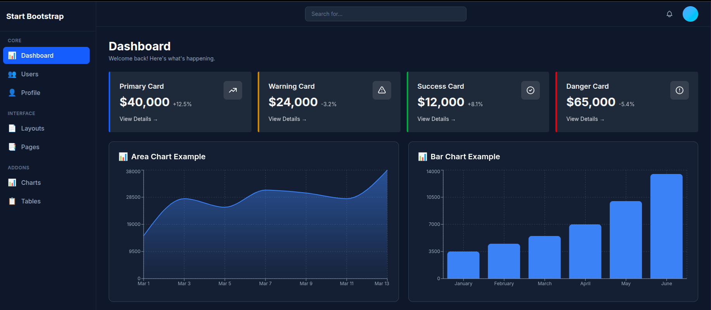
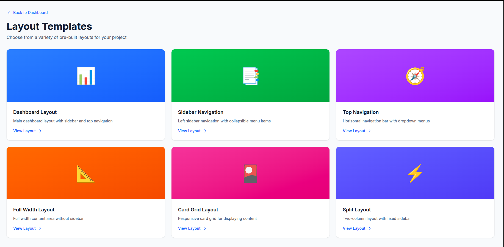

# Week 3 — Day 4: Dynamic UI + Image Optimization

## 🎯 Objective
Build a fully responsive landing page using Next.js with optimized images, SEO metadata, and Tailwind-powered responsive layout — extending the Day 3 multi-page structure.

---

## 📚 Topics Covered

- `next/image` for optimized image rendering
- Responsive images with proper sizing and lazy loading
- Typography & on-page SEO improvements (`metadata` config)
- Animations using Tailwind transition/animation utilities
- Expanded App Router structure with nested routes and client layouts

---

## 🧪 Exercise

Extended the Day 3 project into a full responsive SaaS-style landing page with Hero, Features Grid, Testimonials, and Footer sections. Also expanded the dashboard with stats, profile edit, and users pages.

**Reference UI:** [SB Admin Dashboard](https://assets.startbootstrap.com/img/meta/products/twitter/twitter-image-sb-admin.png)

---

## 📁 Folder Structure

```
DAY_4-Dynamic UI_AND_Image Optimization/
├── app/
│   ├── layout.js                        # Root layout
│   ├── page.js                          # Landing page (Hero, Features, Testimonials, Footer)
│   ├── globals.css
│   ├── favicon.ico
│   ├── login/
│   │   └── page.js                      # Login page
│   ├── about/
│   │   └── layout.js                    # About nested layout
│   ├── dashboard/
│   │   ├── layout.js                    # Dashboard layout
│   │   ├── DashboardClientLayout.js     # Client layout wrapper
│   │   ├── page.js                      # Dashboard home
│   │   ├── profile/
│   │   │   ├── page.js                  # Profile view
│   │   │   └── edit/
│   │   │       └── page.js              # Profile edit
│   │   ├── users/
│   │   │   └── page.js                  # Users listing
│   │   └── stats/
│   │       ├── danger/page.js
│   │       ├── primary/page.js
│   │       ├── success/page.js
│   │       └── warning/page.js
│   └── interface/
│       ├── layouts/page.js
│       └── pages/page.js
└── screenshots/
    ├── landing_page.png
    └── landing_page_1.png
```

---

## 🗺️ Routes Map

| Route | File | Description |
|-------|------|-------------|
| `/` | `app/page.js` | Landing page — Hero, Features, Testimonials, Footer |
| `/login` | `app/login/page.js` | Login page |
| `/about` | `app/about/layout.js` | About page with nested layout |
| `/dashboard` | `app/dashboard/page.js` | Dashboard home with widgets |
| `/dashboard/profile` | `app/dashboard/profile/page.js` | Profile view |
| `/dashboard/profile/edit` | `app/dashboard/profile/edit/page.js` | Profile edit form |
| `/dashboard/users` | `app/dashboard/users/page.js` | Users listing table |
| `/dashboard/stats/primary` | `app/dashboard/stats/primary/page.js` | Primary stats view |
| `/dashboard/stats/success` | `app/dashboard/stats/success/page.js` | Success stats view |
| `/dashboard/stats/warning` | `app/dashboard/stats/warning/page.js` | Warning stats view |
| `/dashboard/stats/danger` | `app/dashboard/stats/danger/page.js` | Danger stats view |
| `/interface/layouts` | `app/interface/layouts/page.js` | Layout showcase |
| `/interface/pages` | `app/interface/pages/page.js` | Pages showcase |

---

## 📸 Screenshots

### 🖥️ Landing Page


### 📱 Landing Page (Responsive)


---

## ✅ Deliverables

- [x] `/app/page.js` — Responsive landing page (Hero, Features Grid, Testimonials, Footer)
- [x] `/app/login/page.js` — Login page
- [x] `/app/dashboard/` — Full dashboard with nested routes
- [x] `/app/dashboard/profile/edit/page.js` — Profile edit page
- [x] `/app/dashboard/users/page.js` — Users listing
- [x] `/app/dashboard/stats/*` — Stats pages (primary, success, warning, danger)
- [x] `next/image` used for optimized image rendering
- [x] SEO metadata configured via Next.js `metadata` export
- [x] Fully responsive layout using Tailwind breakpoints (`sm`, `md`, `lg`, `xl`)

---

## 🔍 SEO Implementation

```js
// app/page.js
export const metadata = {
  title: "My SaaS App — Dashboard",
  description: "A modern SaaS dashboard built with Next.js and TailwindCSS",
  keywords: ["nextjs", "tailwind", "dashboard", "saas"],
  openGraph: {
    title: "My SaaS App",
    description: "Modern dashboard UI",
    type: "website",
  },
};
```

---

## 🖼️ next/image Usage

```jsx
import Image from "next/image";

<Image
  src="/hero-image.png"
  alt="Hero Banner"
  width={1200}
  height={600}
  priority
  className="rounded-xl w-full object-cover"
/>
```

**Benefits over ``:**
- Automatic lazy loading
- Automatic format conversion (WebP)
- Prevents layout shift (CLS)
- Built-in responsive sizing

---

## 💡 Key Learnings

- **`next/image`:** Automatically optimizes images — serves WebP, lazy loads, prevents layout shift
- **SEO metadata:** Exporting `metadata` object from any `page.js` or `layout.js` sets page-level SEO tags
- **`DashboardClientLayout.js`:** Separating client-side interactivity into its own component keeps the layout Server Component by default
- **Deep nested routing:** `/dashboard/profile/edit` is just another folder — Next.js handles it automatically
- **Responsive Tailwind:** Using `sm:`, `md:`, `lg:` prefixes converts desktop layouts to mobile-first seamlessly
