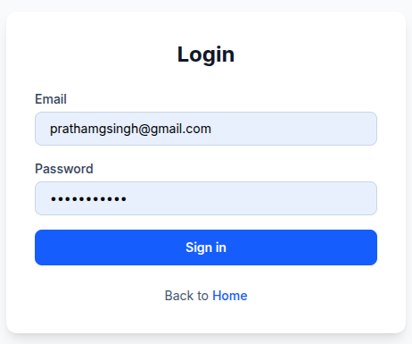
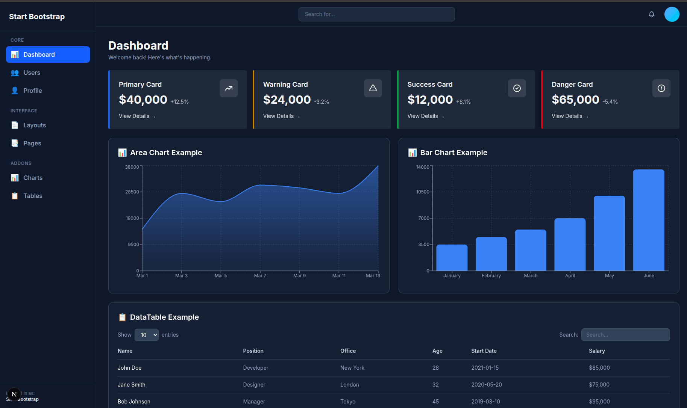
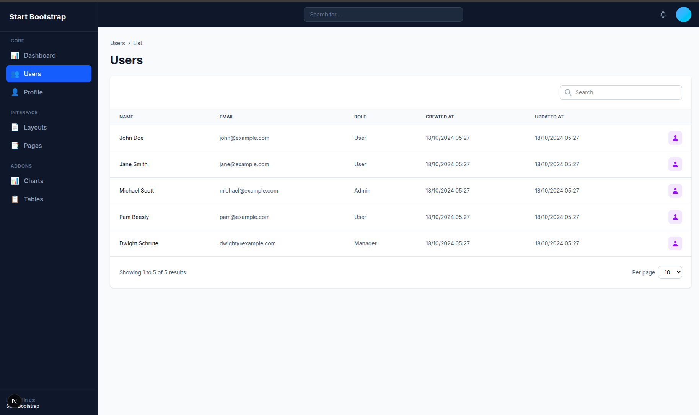
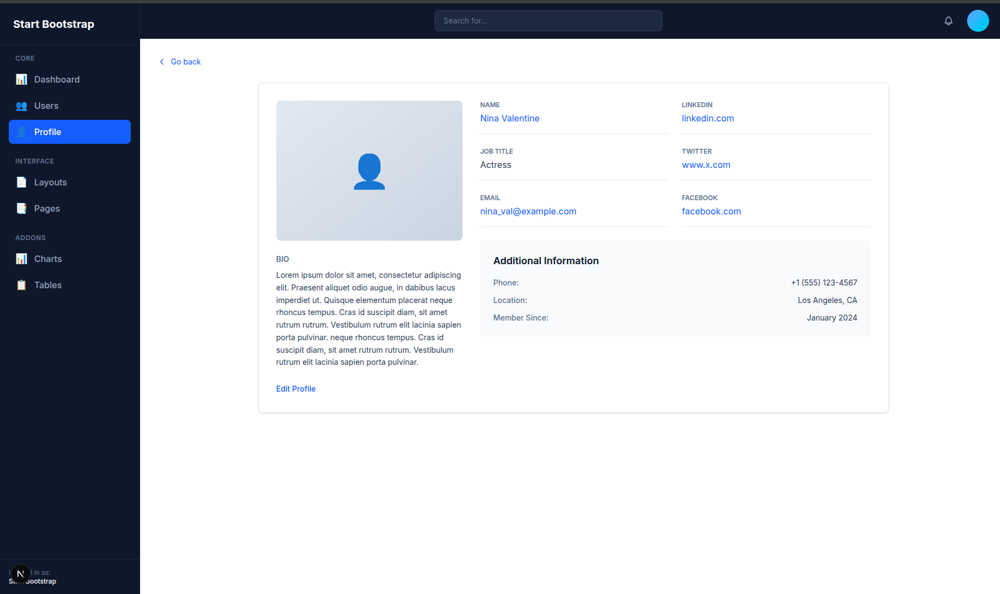

# DAY 5 — Capstone Mini Project

### Full Multi-Page UI with Next.js & Tailwind CSS (No Backend)

This project is the final capstone for **Week 3 – Advanced Frontend**, focused on building a complete **multi-page dashboard UI** using **Next.js App Router** and **Tailwind CSS**, without any backend integration.

---

## Project Overview

A fully responsive dashboard-style application featuring authentication UI, dashboard widgets, user management table, and profile page — all built with reusable UI components.

---

## Tech Stack

- **Next.js (App Router)**
- **Tailwind CSS**
- **Reusable UI Components**
- **Mocked static data**
- **Mobile-first responsive design**

---

## Pages Implemented

| Route | Description |
|------|------------|
| `/login` | Static login form UI |
| `/dashboard` | Dashboard with cards & widgets |
| `/dashboard/users` | Users table with mocked data |
| `/dashboard/profile` | User profile UI |

---

## Folder Structure
```txt
DAY_5-Capstone_Mini_Project/
├── app/
│   ├── login/
│   │   └── page.js
│   └── dashboard/
│       ├── page.js
│       ├── users/
│       │   └── page.js
│       └── profile/
│           └── page.js
├── components/
│   └── ui/
│       ├── Button.jsx
│       ├── Input.jsx
│       ├── Card.jsx
│       ├── Badge.jsx
│       └── Modal.jsx
├── screenshots/
│   ├── login.png
│   ├── dashboard.png
│   ├── users.png
│   └── profile.png
└── README.md
```

---

## Reusable UI Components

All UI elements are reused from `/components/ui`:

- Button
- Input
- Card
- Badge
- Modal

This ensures consistency and follows component-driven development principles.

---

## 📸 Screenshots

### Login Page


### Dashboard


### Users Listing


### Profile Page


---

## Responsive Design

- Mobile-first approach
- Tailwind responsive utilities
- Optimized layout for tablet & desktop

---

## Key Learnings

- Building multi-page layouts using Next.js App Router
- Structuring scalable UI components
- Implementing clean routing for dashboards
- Designing responsive UIs with Tailwind CSS
- Managing layouts without backend dependency

---

## Requirements Checklist

- [x] No backend used
- [x] Clean routing structure
- [x] Component reuse
- [x] Mobile responsive UI
- [x] Screenshots added
- [x] Proper documentation

## Next steps (recommended)

After adding this file:
```bash
git add DAY_5-Capstone_Mini_Project/README.md
git add DAY_5-Capstone_Mini_Project/screenshots
git commit -m "Docs: Add complete Day 5 capstone README with screenshots"
git push origin main
```

