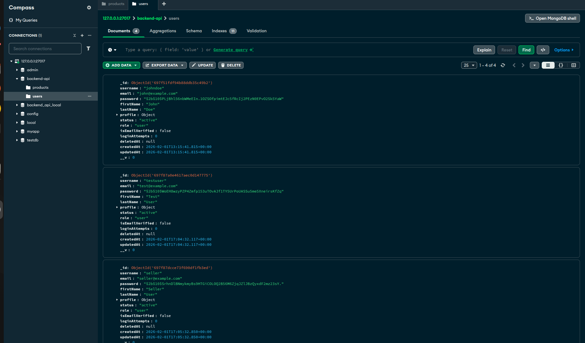
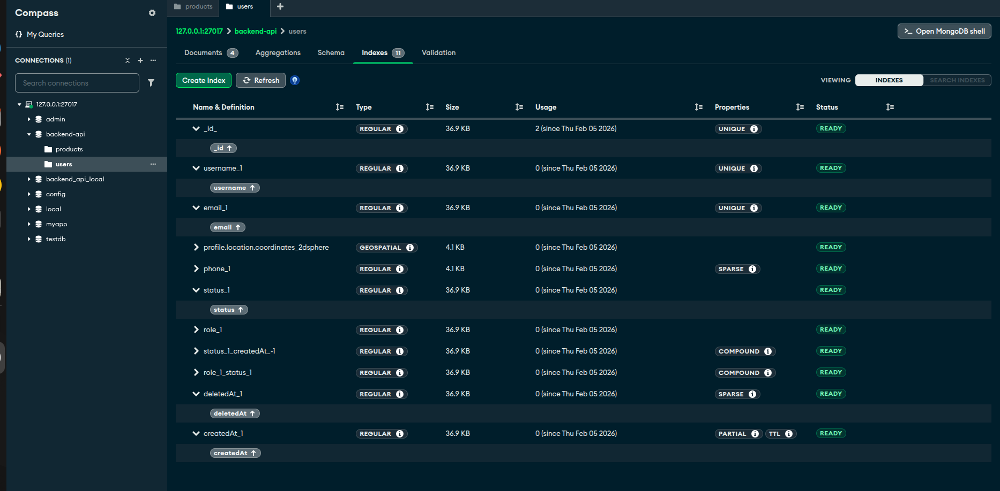
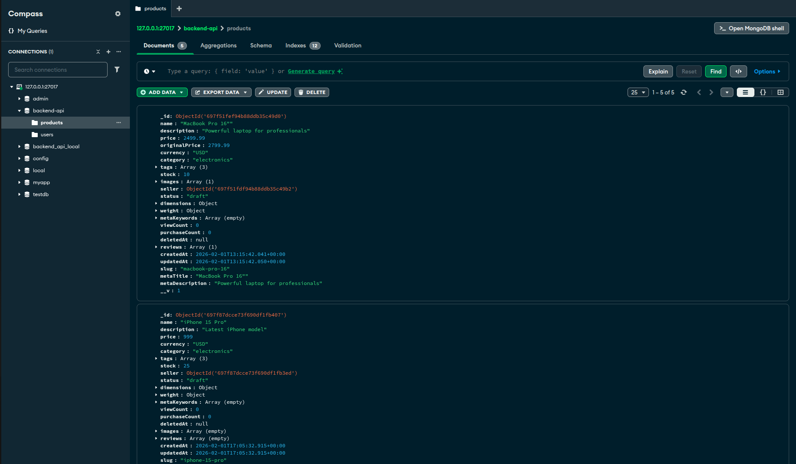
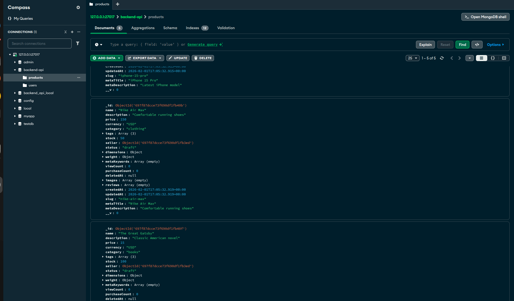
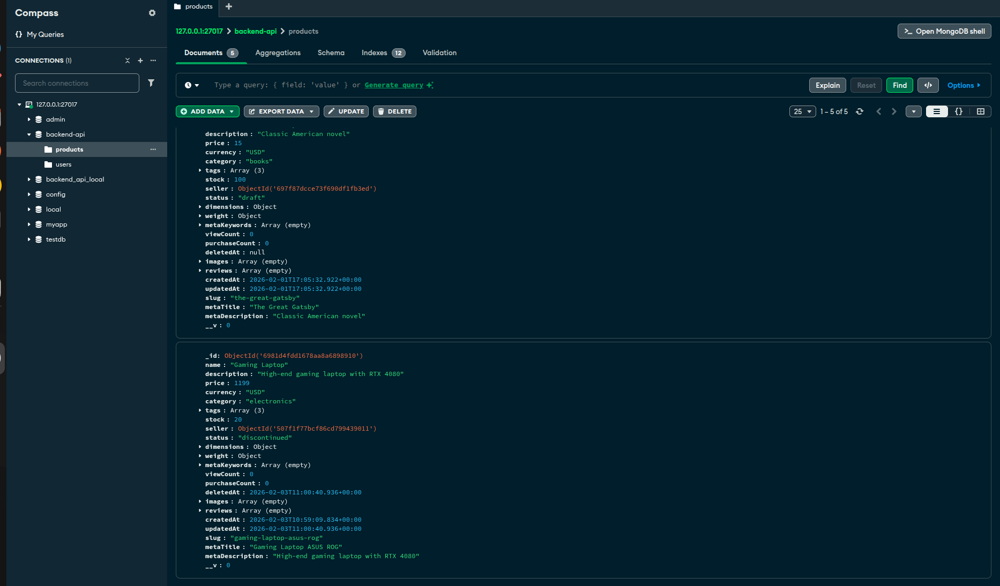
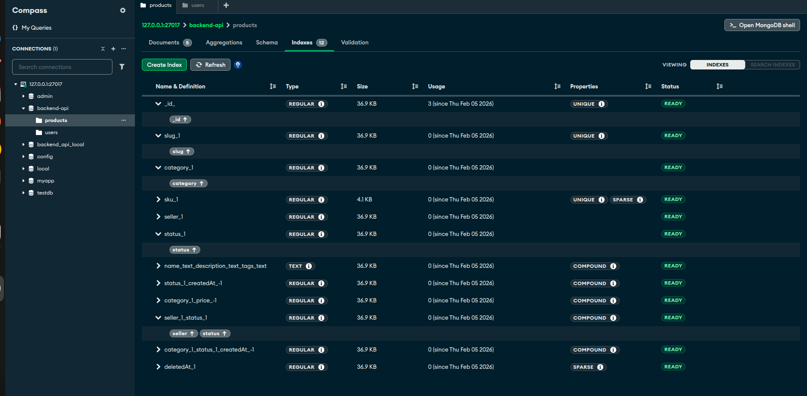

# Week 4 — Day 2: Database Modeling + Indexing + Advanced CRUD

## 🎯 Objective
Design real-world Mongoose schemas with hooks, virtual fields, indexes, and implement the Repository Pattern for clean, reusable data access logic.

---

## 📚 Topics Covered

- Embedded vs Referenced schema design
- TTL indexes and Sparse + Compound indexes
- Mongoose pre-save hooks (password hashing, preprocessing)
- Virtual fields (`fullName`, computed `rating`)
- Pagination strategies (`skip/limit` vs cursor-based)
- Repository Pattern for separating data access from business logic

---

## 🧪 Exercise

Built `User` and `Product` Mongoose schemas with hooks, virtuals, compound indexes, and field validation. Implemented a full Repository Pattern with paginated queries.

---

## 📁 Folder Structure

```
DAY_2-DATABASE MODELING _INDEXING_ANDADVANCED CRUD/
├── User.js                        # User Mongoose schema with hooks + virtuals
├── Product.js                     # Product Mongoose schema with indexes + validation
├── user.repository.js             # UserRepository — create, findById, findPaginated, update, delete
├── product.repository.js          # ProductRepository — create, findById, findPaginated, update, delete
└── INDEX_SCREENSHOTS/
    ├── USER_DOC.png               # User document in MongoDB Compass
    ├── USER_INDEXES.png           # User collection indexes
    ├── PRODUCT_DOC_1.png          # Product document view 1
    ├── PRODUCT_DOC_2.png          # Product document view 2
    ├── PRODUCT_DOC_3.png          # Product document view 3
    └── PRODUCT_INDEXES.png        # Product collection indexes
```

---

## 🧩 Schema Design

### User Schema (`User.js`)
- `firstName`, `lastName`, `email`, `password`, `status`, `createdAt`
- **Pre-save hook:** Hashes password before saving using bcrypt
- **Virtual field:** `fullName` → computed from `firstName + lastName`
- **Compound index:** `{ status: 1, createdAt: -1 }`
- **Sparse index:** on `email` (unique, only indexed when present)

### Product Schema (`Product.js`)
- `title`, `description`, `price`, `category`, `ratings[]`, `status`, `createdAt`
- **Virtual field:** `averageRating` → computed from `ratings` array
- **Compound index:** `{ status: 1, createdAt: -1 }`
- **Field validation:** price min 0, title required, category enum validation

---

## 🗃️ Repository Pattern

### UserRepository (`user.repository.js`)

| Method | Description |
|--------|-------------|
| `UserRepository.create(data)` | Creates and saves a new user |
| `UserRepository.findById(id)` | Finds a user by MongoDB `_id` |
| `UserRepository.findPaginated(page, limit)` | Returns paginated users with total count |
| `UserRepository.update(id, data)` | Updates user fields by `_id` |
| `UserRepository.delete(id)` | Soft/hard deletes a user by `_id` |

### ProductRepository (`product.repository.js`)

| Method | Description |
|--------|-------------|
| `ProductRepository.create(data)` | Creates and saves a new product |
| `ProductRepository.findById(id)` | Finds a product by MongoDB `_id` |
| `ProductRepository.findPaginated(page, limit)` | Returns paginated products with total count |
| `ProductRepository.update(id, data)` | Updates product fields by `_id` |
| `ProductRepository.delete(id)` | Soft/hard deletes a product by `_id` |

---

## 📸 Screenshots — MongoDB Compass Index Analysis

### 👤 User Collection

#### User Document


#### User Indexes


---

### 📦 Product Collection

#### Product Document (View 1)


#### Product Document (View 2)


#### Product Document (View 3)


#### Product Indexes


---

## 🔍 Index Strategy

| Index Type | Field(s) | Purpose |
|------------|----------|---------|
| Compound | `{ status: 1, createdAt: -1 }` | Fast filtered + sorted queries |
| Sparse | `email` | Only indexes documents where email exists |
| TTL | `createdAt` (optional) | Auto-expire documents after set duration |

---

## 📄 Pagination Strategy

### skip/limit (used)
```js
const users = await User.find()
  .skip((page - 1) * limit)
  .limit(limit)
  .sort({ createdAt: -1 });
```
- Simple to implement
- Good for small/medium datasets
- Gets slower on large offsets

### Cursor-based (alternative)
```js
const users = await User.find({ _id: { $gt: lastId } }).limit(limit);
```
- Faster on large datasets
- No offset degradation
- Ideal for infinite scroll / feeds

---

## ✅ Deliverables

- [x] `User.js` — Schema with pre-save hook, virtual `fullName`, compound index
- [x] `Product.js` — Schema with virtual `averageRating`, compound index, validation
- [x] `user.repository.js` — Full CRUD + paginated query repository
- [x] `product.repository.js` — Full CRUD + paginated query repository
- [x] MongoDB Compass index analysis screenshots (User + Product)

---

## 💡 Key Learnings

- **Repository Pattern:** Decouples data access from business logic — controllers stay clean and repositories handle all DB interactions
- **Pre-save hooks:** `schema.pre("save")` runs before every `.save()` — perfect for hashing passwords or normalizing data
- **Virtual fields:** Computed properties like `fullName` or `averageRating` that aren't stored in DB but available on the document
- **Compound indexes:** `{ status: 1, createdAt: -1 }` dramatically speeds up filtered + sorted queries that match both fields
- **Sparse indexes:** Only index documents where the field exists — saves space when fields are optional

