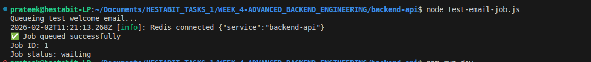
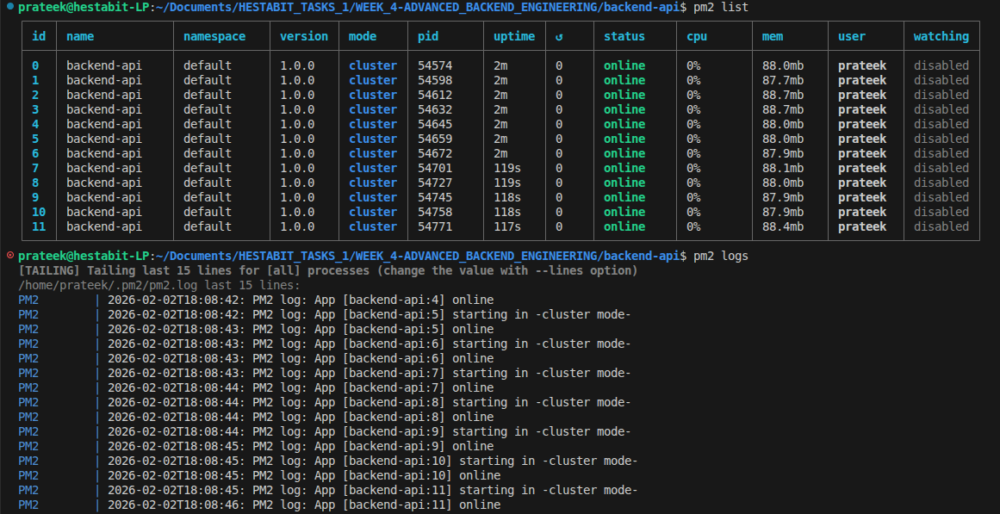
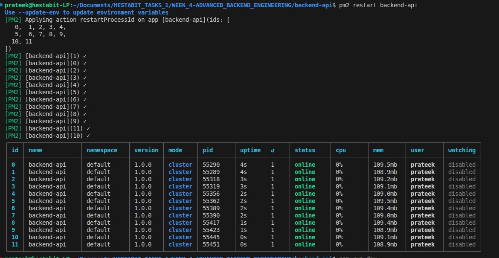
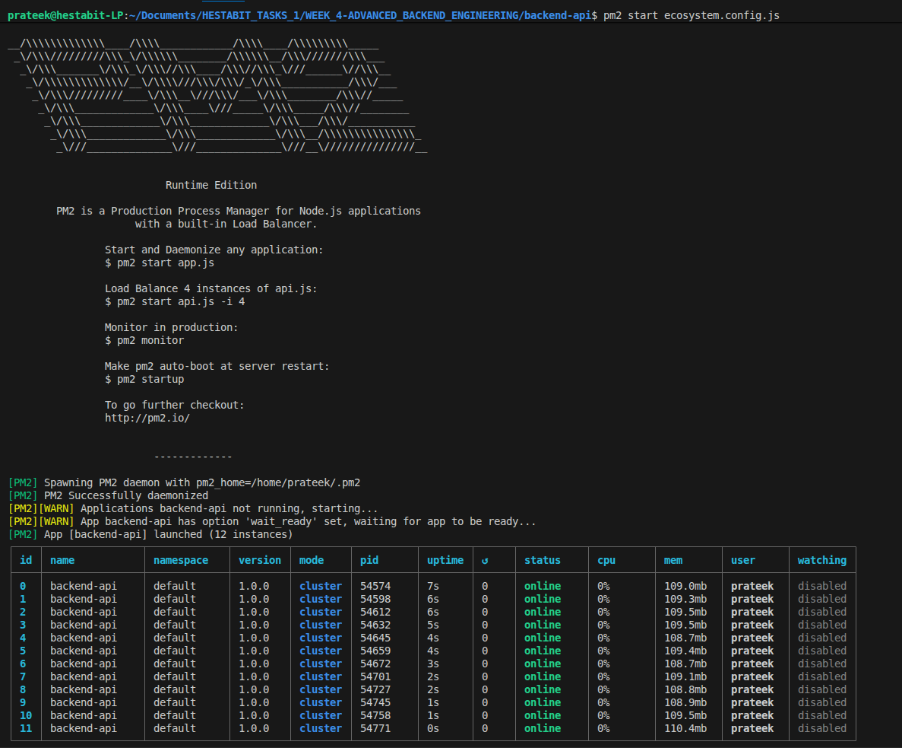
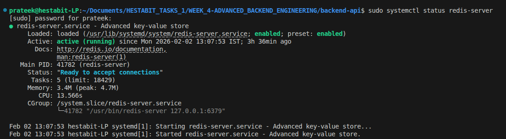

# Week 4 — Day 3: High-Performance REST API + Advanced Query Engine

## 🎯 Objective
Build a production-grade REST API with a dynamic query engine, soft deletes, and centralized error handling following the Controller → Service → Repository architecture.

---

## 📚 Topics Covered

- Controller → Service → Repository flow
- Dynamic search engine (regex + OR/AND conditions)
- Complex filtering, sorting, and pagination in a single query
- Soft deletes (`deletedAt` flag + timestamp)
- Advanced error handling — typed errors, error codes, centralized middleware
- PM2 process management and Redis server integration

---

## 🧪 Exercise

Built a full Product API with a dynamic query engine supporting search, filters, sorting, pagination, and soft delete — all in a single `GET /products` endpoint. Implemented global error formatting and centralized error middleware.

---

## 📁 Folder Structure

```
DAY_3-HIGH-PERFORMANCE REST API_AND_ADV QUERY ENGINE/
├── product.controller.js        # Route handlers — delegates to service layer
├── product.service.js           # Business logic — builds dynamic queries
├── error.js                     # Typed errors + centralized error middleware
├── QUERY ENGINE DOC.md          # Query engine documentation
└── SCREENSHOTS/
    ├── EMAIL_TESTING.png        # Email notification testing
    ├── PM2_LIST.png             # PM2 process list
    ├── PM2_RESTART.png          # PM2 restart command
    ├── PM2_START_ECOSYSTEM.png  # PM2 ecosystem config startup
    └── REDIS_SERVER.png         # Redis server running
```

---

## 🗺️ API Endpoints

| Method | Endpoint | Description |
|--------|----------|-------------|
| `GET` | `/products` | Fetch products with dynamic filters, search, sort, pagination |
| `GET` | `/products?includeDeleted=true` | Fetch including soft-deleted products |
| `GET` | `/products/:id` | Fetch single product by ID |
| `POST` | `/products` | Create a new product |
| `PUT` | `/products/:id` | Update product by ID |
| `DELETE` | `/products/:id` | Soft delete — sets `deletedAt` timestamp |

---

## 🔍 Dynamic Query Engine

### Example Request
```
GET /products?search=phone&minPrice=100&maxPrice=500&sort=price:desc&tags=apple,samsung
```

### Query Parameters

| Parameter | Type | Description |
|-----------|------|-------------|
| `search` | `string` | Regex search on `title` and `description` |
| `minPrice` | `number` | Minimum price filter |
| `maxPrice` | `number` | Maximum price filter |
| `sort` | `string` | Format: `field:asc` or `field:desc` |
| `tags` | `string` | Comma-separated tags — OR condition |
| `page` | `number` | Page number (default: 1) |
| `limit` | `number` | Results per page (default: 10) |
| `includeDeleted` | `boolean` | Include soft-deleted records |

---

## 🗑️ Soft Delete Implementation

```js
// DELETE /products/:id
// Marks deletedAt instead of removing the document
await Product.findByIdAndUpdate(id, { deletedAt: new Date() });

// GET /products — excludes soft-deleted by default
filter.deletedAt = { $exists: false };

// GET /products?includeDeleted=true — includes all
if (includeDeleted) delete filter.deletedAt;
```

---

## ⚠️ Global Error Format

```json
{
  "success": false,
  "message": "Product not found",
  "code": "PRODUCT_NOT_FOUND",
  "timestamp": "2025-07-01T10:30:00.000Z",
  "path": "/products/abc123"
}
```

---

## 📸 Screenshots

### 📧 Email Testing


### 🟢 PM2 Process List


### 🔄 PM2 Restart


### 🚀 PM2 Start Ecosystem


### 🔴 Redis Server


---

## ✅ Deliverables

- [x] `product.controller.js` — Route handlers delegating to service layer
- [x] `product.service.js` — Dynamic query builder with filters, sort, pagination
- [x] `error.js` — Typed errors + centralized error middleware
- [x] `QUERY ENGINE DOC.md` — Full query engine documentation
- [x] PM2 and Redis server setup screenshots

---

## 💡 Key Learnings

- **Controller → Service → Repository:** Each layer has one responsibility — controllers handle HTTP, services handle logic, repositories handle DB
- **Dynamic query builder:** Building a filter object progressively from query params keeps the code clean and extensible
- **Soft deletes:** Setting `deletedAt` instead of removing records preserves data history and allows recovery
- **Centralized error middleware:** A single Express error handler catches all thrown errors and formats them consistently
- **PM2:** Process manager that keeps Node.js apps alive, restarts on crash, and manages multiple processes via ecosystem config
- **Redis:** Used for caching frequent queries to reduce DB load and improve API response times
