# Week 4 — Day 5: Job Queues + Logging + API Documentation + Capstone

## 🎯 Objective
Build a production-ready backend with async background jobs, structured logging with request tracing, full API documentation, and a deploy-ready folder using PM2.

---

## 📚 Topics Covered

- Job queue design using BullMQ (Redis-backed)
- Background job: email notification with retry + backoff
- Structured logging with correlation IDs
- Request tracing via `X-Request-ID` header
- API documentation via Postman Collection
- PM2 ecosystem config for production deployment

---

## 🧪 Exercise

Implemented a BullMQ-powered email job queue with a dedicated worker processor, request tracing middleware, structured log files, and a complete Postman collection export for API documentation.

---

## 📁 Folder Structure

```
DAY_5-JOB QUEUES_LOGGING_API_DOCUMENTATION_CAPSTONE/
├── email.job.js                    # BullMQ job definition — adds email jobs to queue
├── email.processor.js              # Worker process — consumes and processes email jobs
├── Day 5 - cURL Commands.md        # cURL reference for all API endpoints
├── Day5-postman_collection.json    # Postman collection export
├── DEPLOYMENT NOTES.md             # PM2 + deployment instructions
├── logs_file/
│   ├── app.log                     # Application structured logs with request IDs
│   └── pm2-out.log                 # PM2 process output logs
└── SCREENSHOTS/
    ├── POSTMAN_SCREENSHOT_1.png
    ├── POSTMAN_SCREENSHOT_2.png
    ├── POSTMAN_SCREENSHOT_3.png
    ├── POSTMAN_SCREENSHOT_4.png
    ├── POSTMAN_SCREENSHOT_5.png
    ├── POSTMAN_SCREENSHOT_6.png
    ├── POSTMAN_SCREENSHOT_7.png
    ├── POSTMAN_SCREENSHOT_8.png
    ├── POSTMAN_SCREENSHOT_9.png
    ├── POSTMAN_SCREENSHOT_10.png
    ├── POSTMAN_SCREENSHOT_11.png
    └── POSTMAN_SCREENSHOT_12.png
```

---

## 📬 Email Job Queue (`email.job.js` + `email.processor.js`)

### Job Definition — `email.job.js`
```js
// Adds an email job to the BullMQ queue
import { Queue } from "bullmq";

const emailQueue = new Queue("emailQueue", {
  connection: { host: "localhost", port: 6379 }
});

export const addEmailJob = async (data) => {
  await emailQueue.add("sendEmail", data, {
    attempts: 3,
    backoff: { type: "exponential", delay: 5000 }
  });
};
```

### Worker Processor — `email.processor.js`
```js
// Consumes jobs from the queue and sends emails
import { Worker } from "bullmq";

const worker = new Worker("emailQueue", async (job) => {
  console.log(`[${job.id}] Processing email to: ${job.data.to}`);
  // Send email via nodemailer / SendGrid
}, { connection: { host: "localhost", port: 6379 } });

worker.on("completed", (job) => console.log(`Job ${job.id} completed`));
worker.on("failed", (job, err) => console.error(`Job ${job.id} failed:`, err));
```

### Retry + Backoff Strategy
| Attempt | Delay |
|---------|-------|
| 1st retry | 5s |
| 2nd retry | 25s |
| 3rd retry | 125s |

---

## 🔍 Request Tracing

Every request gets a unique `X-Request-ID` header — all logs for that request are grouped by this ID:

```js
// tracing middleware
app.use((req, res, next) => {
  req.requestId = req.headers["x-request-id"] || crypto.randomUUID();
  res.setHeader("X-Request-ID", req.requestId);
  next();
});
```

### Log Format
```json
{
  "level": "info",
  "requestId": "a1b2c3d4-...",
  "method": "POST",
  "path": "/api/products",
  "status": 201,
  "duration": "42ms",
  "timestamp": "2025-07-01T10:30:00.000Z"
}
```

---

## 📄 API Documentation

- **Postman Collection:** `Day5-postman_collection.json` — import directly into Postman
- **cURL Reference:** `Day 5 - cURL Commands.md` — all endpoints with example requests

### Importing Postman Collection
1. Open Postman
2. Click **Import**
3. Select `Day5-postman_collection.json`
4. Set environment variable `BASE_URL = http://localhost:3000`

---

## 📸 Screenshots — Postman API Testing

### Test 1
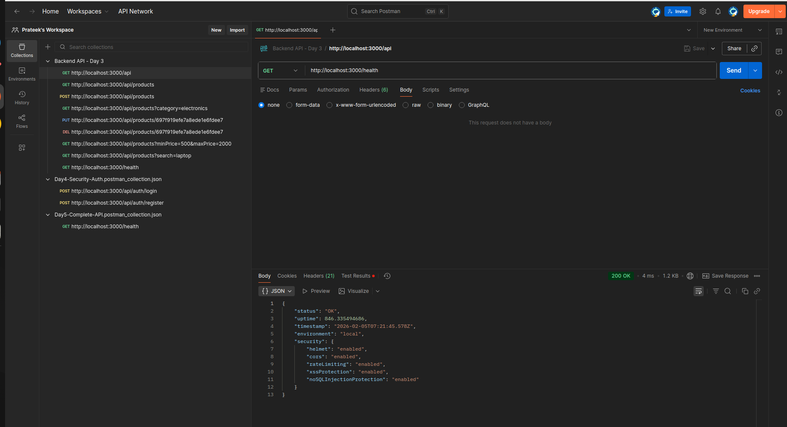

### Test 2
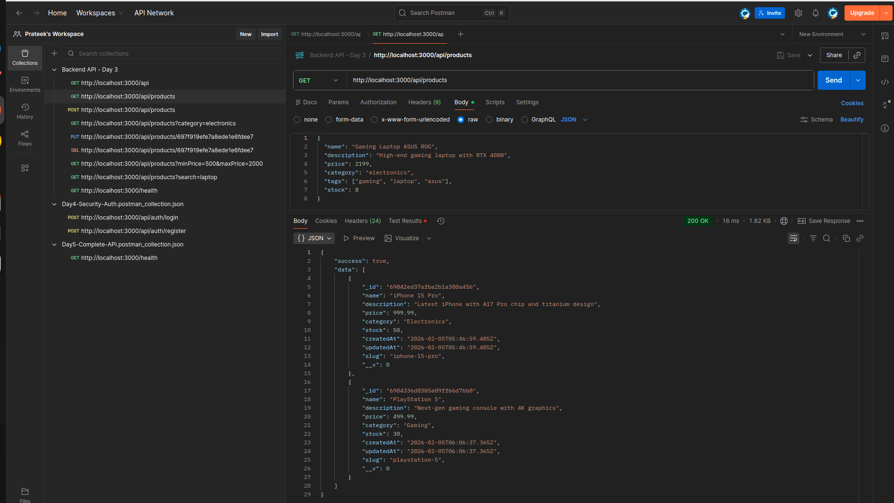

### Test 3
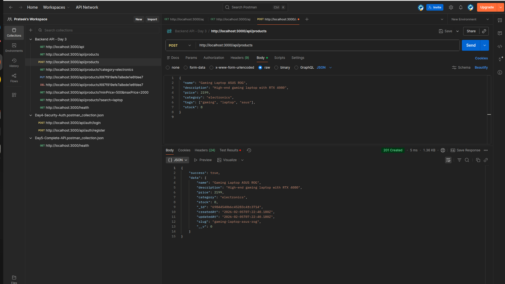

### Test 4
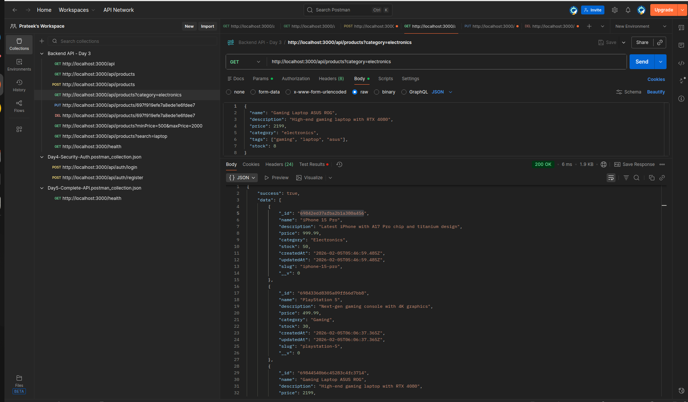

### Test 5
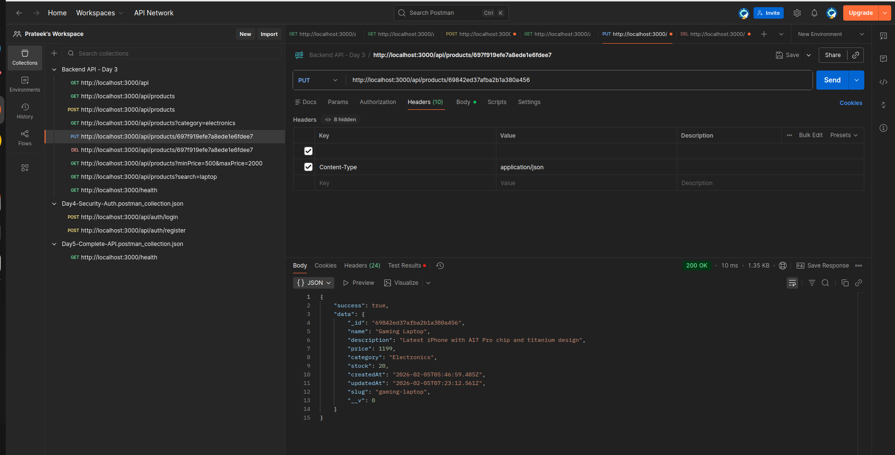

### Test 6
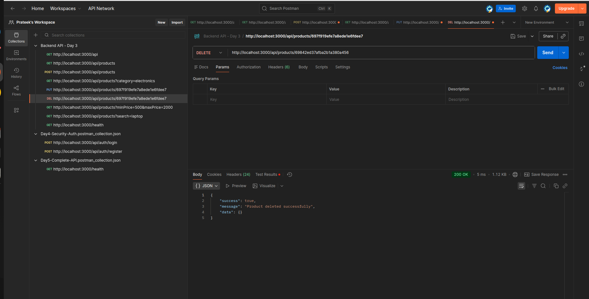

### Test 7
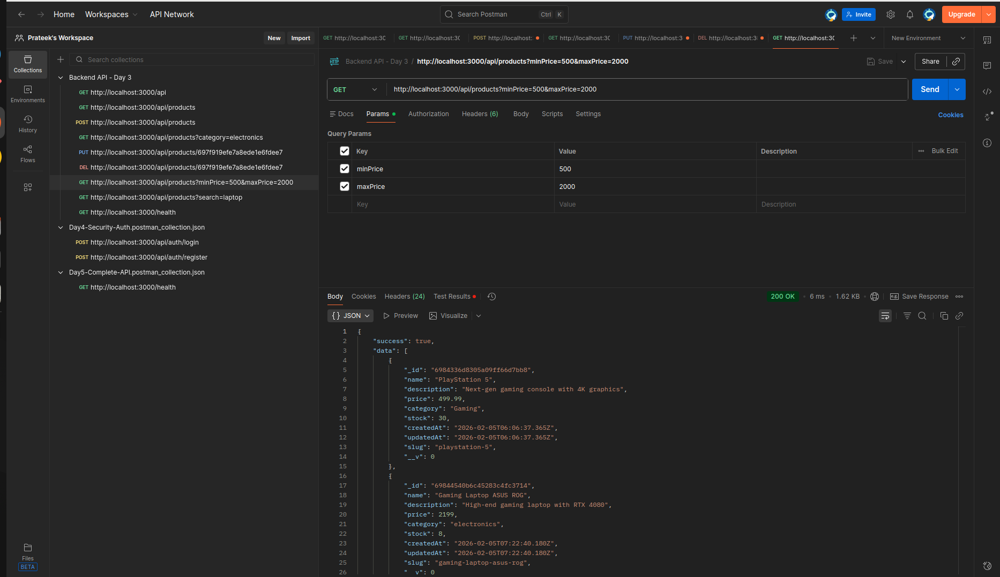

### Test 8


### Test 9
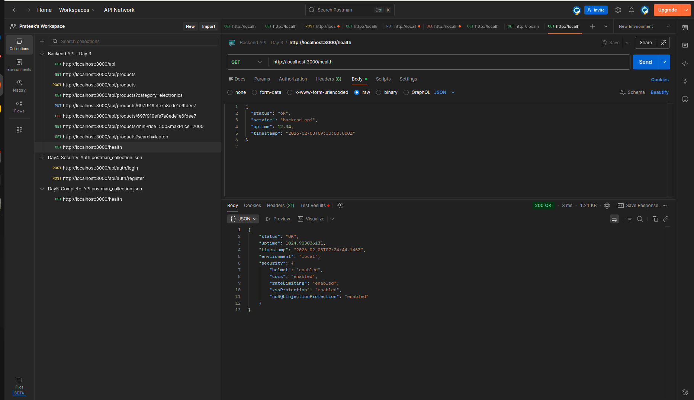

### Test 10
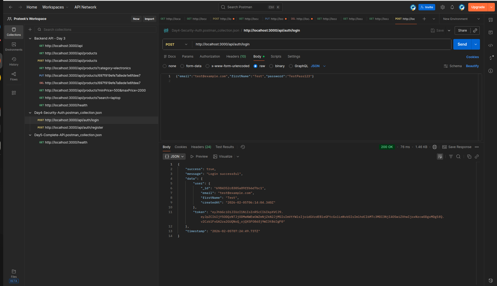

### Test 11
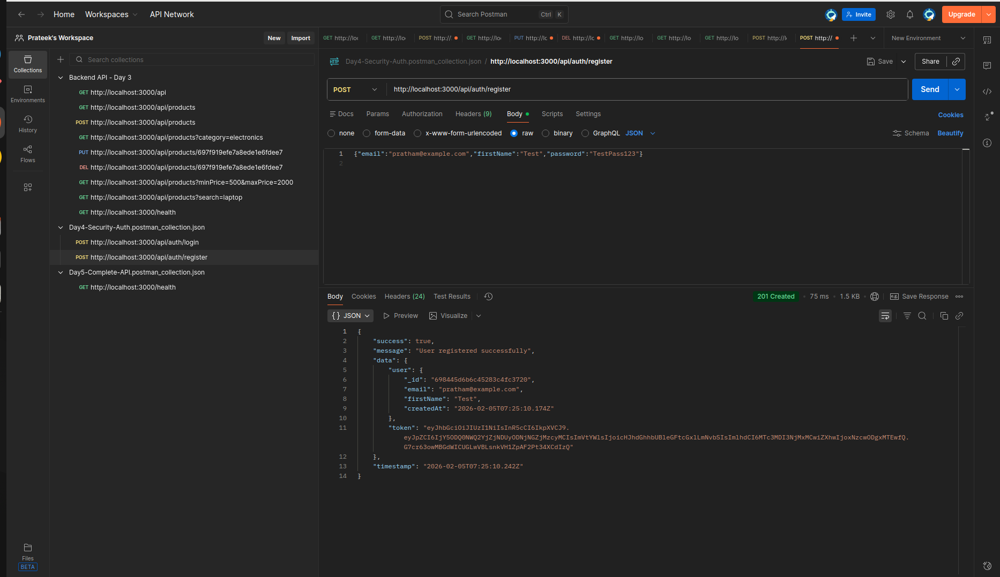

### Test 12
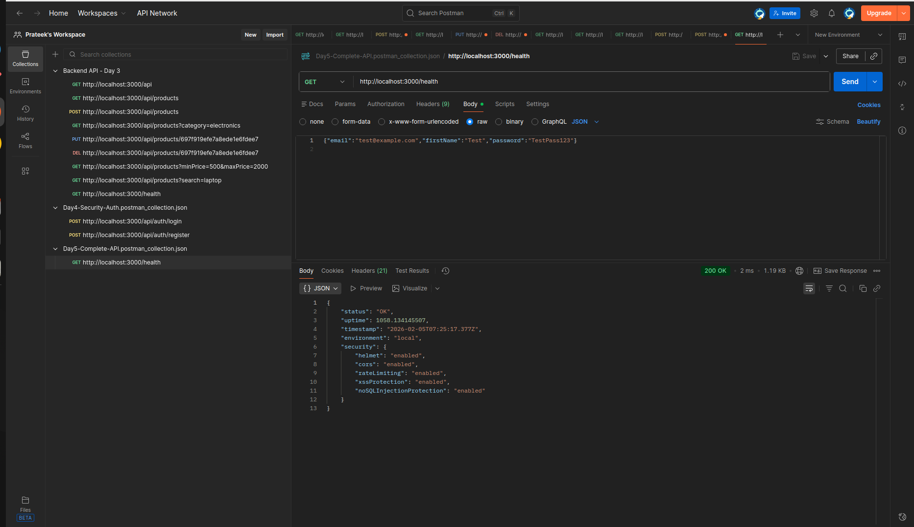

---

## ✅ Deliverables

- [x] `email.job.js` — BullMQ job definition with retry + exponential backoff
- [x] `email.processor.js` — Worker process consuming email jobs from queue
- [x] `logs_file/app.log` — Structured application logs with request IDs
- [x] `logs_file/pm2-out.log` — PM2 process output logs
- [x] `Day5-postman_collection.json` — Full Postman collection export
- [x] `Day 5 - cURL Commands.md` — cURL reference for all endpoints
- [x] `DEPLOYMENT NOTES.md` — PM2 ecosystem config + deployment instructions
- [x] 12 Postman API testing screenshots

---

## 💡 Key Learnings

- **BullMQ:** Redis-backed job queue that persists jobs, supports retries with exponential backoff, and separates job producers from worker consumers
- **Exponential backoff:** Increasing delay between retries (5s → 25s → 125s) prevents overwhelming a failing service
- **Request tracing:** Attaching a unique `X-Request-ID` to every request makes debugging distributed logs trivial — filter all logs by ID to see the full request lifecycle
- **Structured logging:** JSON logs with consistent fields (`requestId`, `method`, `path`, `duration`) are machine-readable and integrate with log aggregators like Datadog or ELK
- **PM2 ecosystem config:** Defining app config in `ecosystem.config.js` makes deployment reproducible — one command starts all processes with correct env vars and cluster mode
- **Postman collections:** Exporting collections as JSON enables team-wide API documentation that stays in sync with the codebase

