# Week 5 — Day 1: Docker Fundamentals + Linux Internals

## 🎯 Objective
Understand how Docker works at a foundational level — images, containers, volumes, networks — and explore Linux internals inside a running container.

---

## 📚 Topics Covered

- Docker images, containers, volumes and networks
- Writing a `Dockerfile` for a Node.js app
- Container OS operations: users, permissions, logs, processes
- Entering a running container using `docker exec`
- Exploring Linux internals: `ls`, `ps`, `top`, disk usage, logs

---

## 🧪 Exercise

Built a Dockerized Node.js app, entered the running container via shell, and documented the Linux internals observed inside the container environment.

---

## 📁 Folder Structure

```
DAY_1-DOCKER_FUNDAMENTALS/
├── Dockerfile                  # Node.js app container definition
├── linux-in-container.md       # Documented Linux internals inside container
└── SCREENSHOTS/
    ├── SCREENSHOT_1.png
    ├── SCREENSHOT_2.png
    ├── SCREENSHOT_3.png
    ├── SCREENSHOT_4.png
    ├── SCREENSHOT_5.png
    ├── SCREENSHOT_6.png
    ├── SCREENSHOT_7.png
    ├── SCREENSHOT_8.png
    ├── SCREENSHOT_9.png
    ├── SCREENSHOT_10.png
    ├── SCREENSHOT_11.png
    ├── SCREENSHOT_12.png
    ├── SCREENSHOT_13.png
    ├── SCREENSHOT_14.png
    └── SCREENSHOT_15.png
```

---

## 🐳 Dockerfile

```dockerfile
FROM node:18-alpine
WORKDIR /app
COPY package*.json ./
RUN npm install
COPY . .
EXPOSE 3000
CMD ["node", "index.js"]
```

---

## 🔧 Key Docker Commands Used

```bash
# Build image
docker build -t my-node-app .

# Run container
docker run -d -p 3000:3000 --name my-app my-node-app

# Enter container shell
docker exec -it my-app /bin/sh

# Inside container — explore Linux internals
ls -la                  # List files and permissions
ps aux                  # Running processes
top                     # Live resource usage
df -h                   # Disk usage
cat /var/log/*.log      # Logs inside container
whoami                  # Current user
id                      # User + group IDs

# Stop and remove
docker stop my-app && docker rm my-app
```

---

## 📸 Screenshots

### Screenshot 1
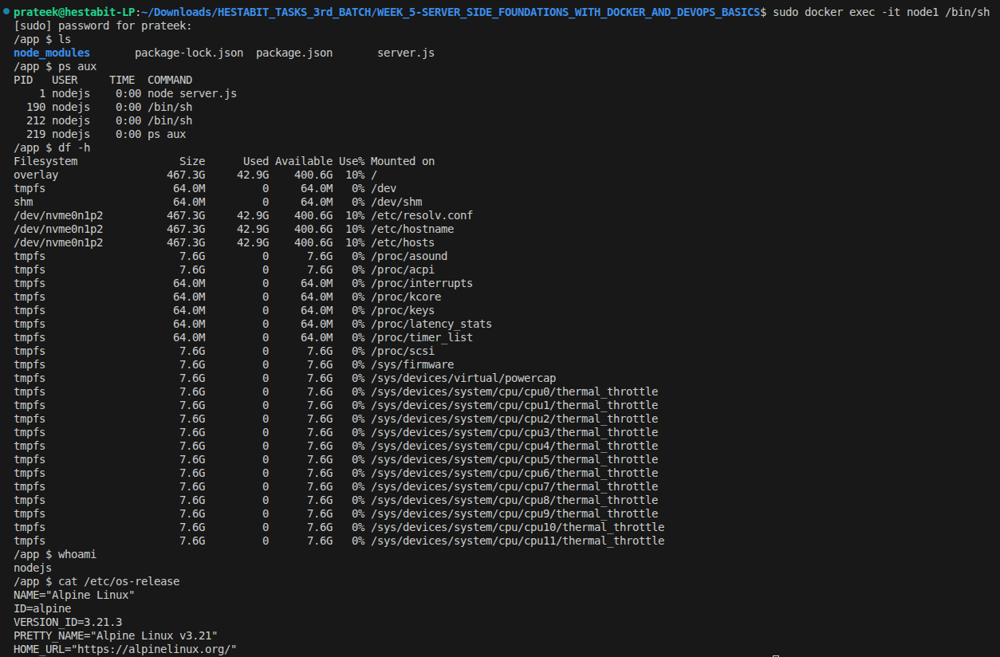

### Screenshot 2
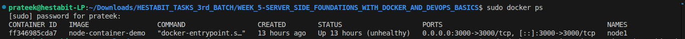

### Screenshot 3
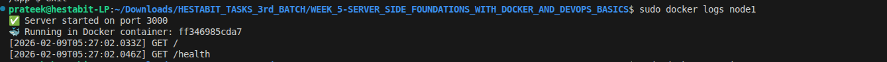

### Screenshot 4
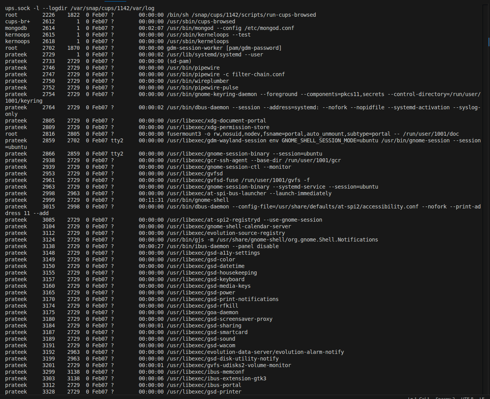

### Screenshot 5
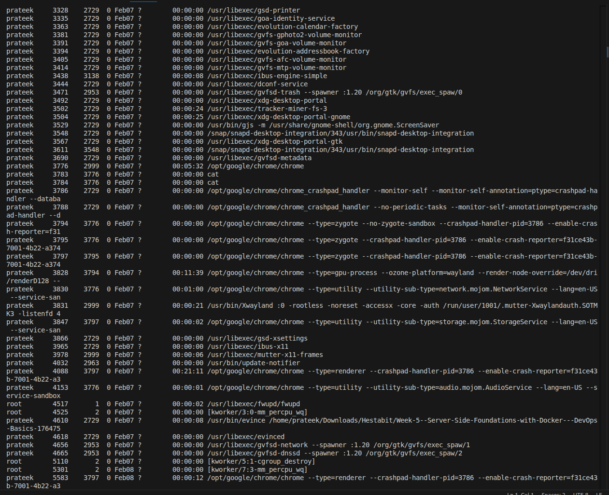

### Screenshot 6
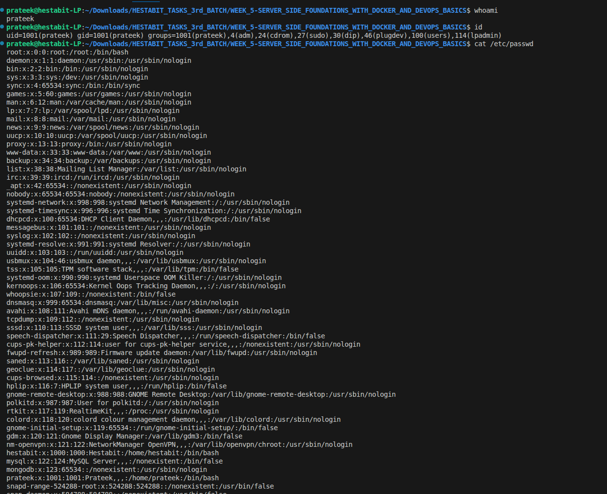

### Screenshot 7
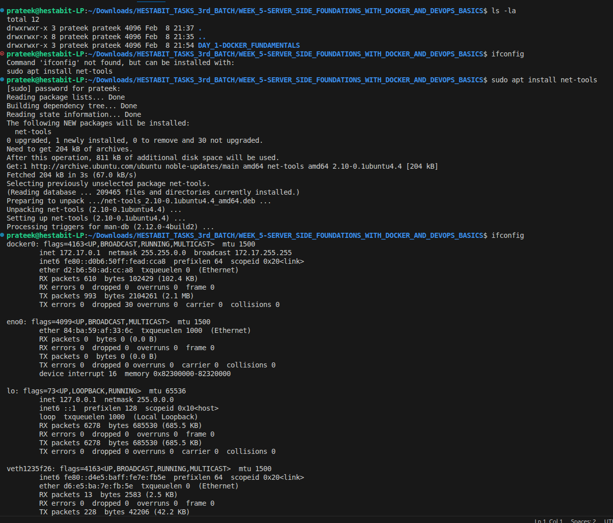

### Screenshot 8
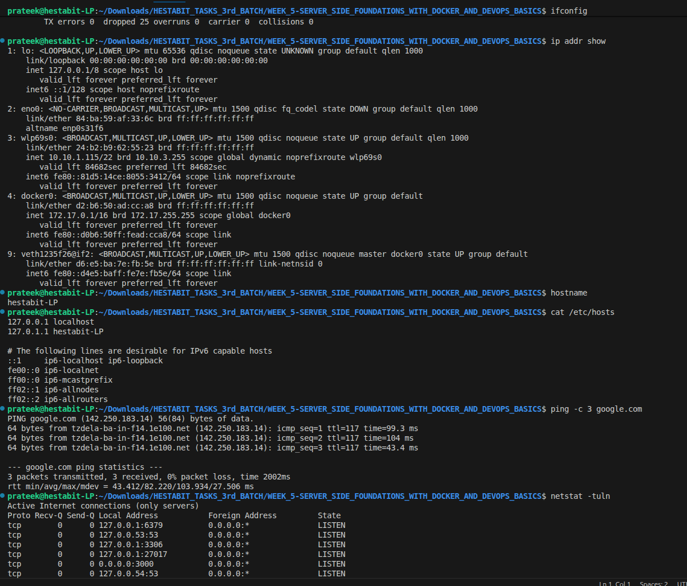

### Screenshot 9
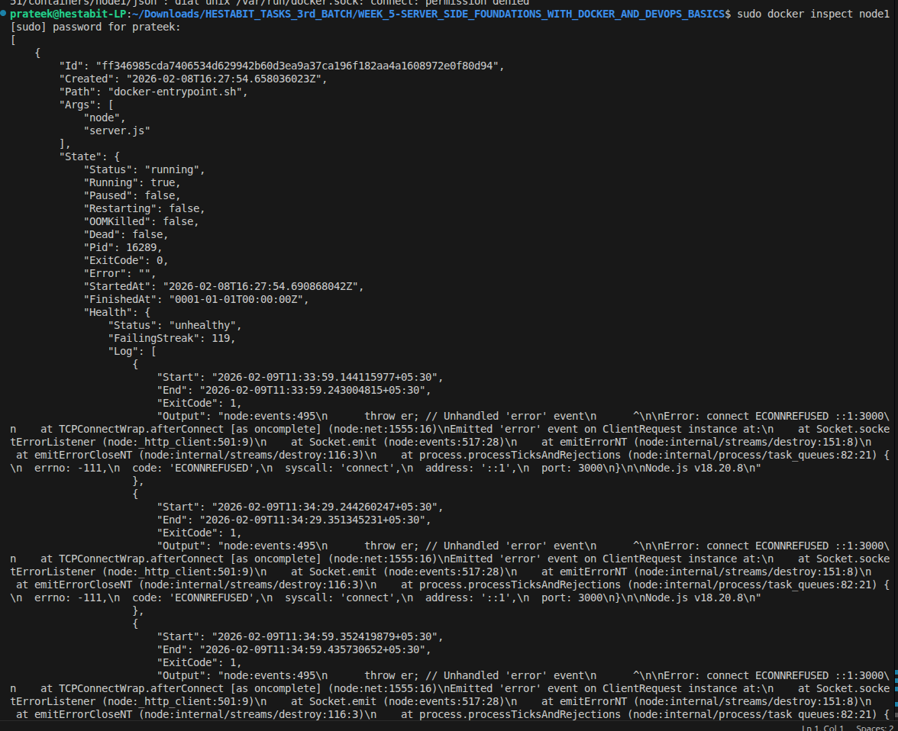

### Screenshot 10
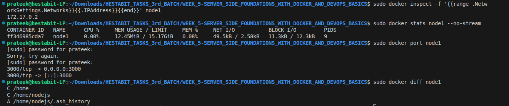

### Screenshot 11
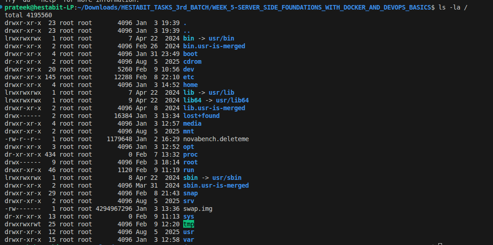

### Screenshot 12
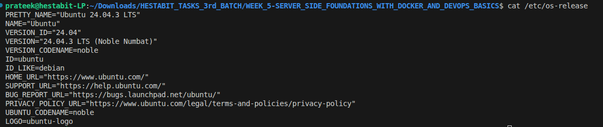

### Screenshot 13
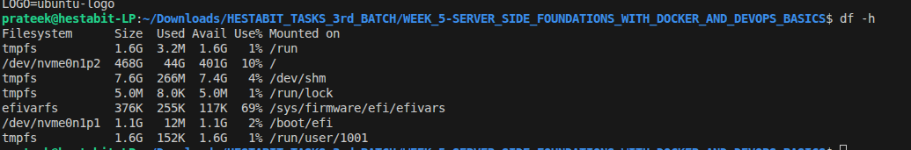

### Screenshot 14
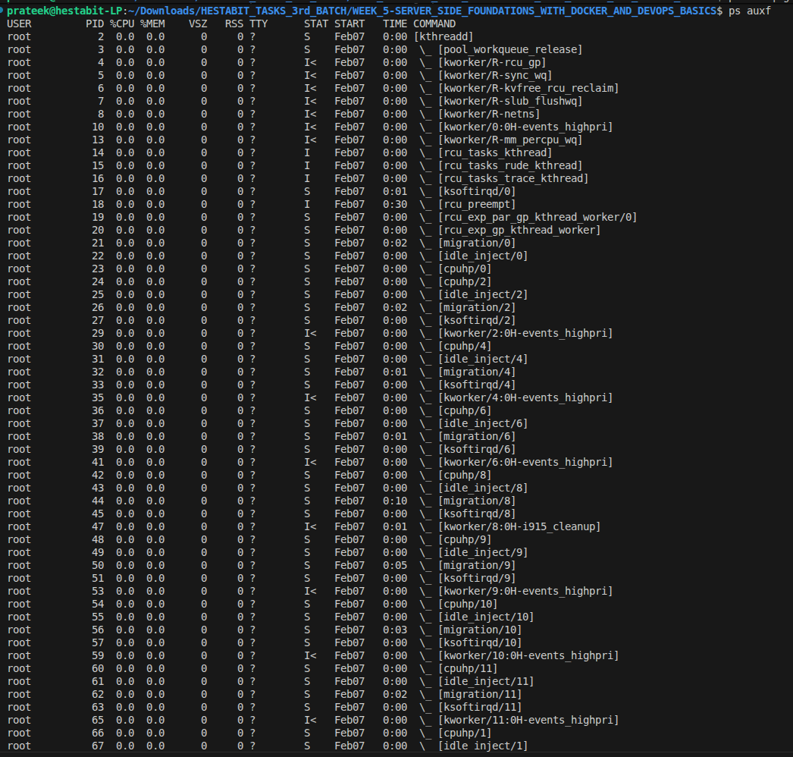

### Screenshot 15
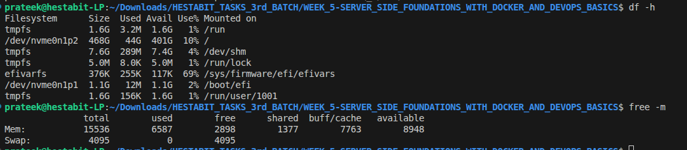

---

## ✅ Deliverables

- [x] `Dockerfile` — Node.js app container definition
- [x] `linux-in-container.md` — Documented Linux internals inside container
- [x] 15 screenshots of Docker and Linux exploration

---

## 💡 Key Learnings

- **Images vs Containers:** An image is a blueprint; a container is a running instance of that image
- **Alpine base image:** `node:18-alpine` is ~50MB vs ~900MB for full Node image — always prefer slim images
- **`docker exec -it`:** Lets you enter a running container like SSH — essential for debugging
- **Linux inside containers:** Containers share the host kernel but have isolated filesystems, processes and users
- **Volumes:** Mount host directories into containers so data persists after container stops

