# Week 5 — Day 2: Docker Compose + Multi-Container Apps

## 🎯 Objective
Deploy a full-stack application (React + Node.js + MongoDB) using Docker Compose with a single command, proper container networking, persistent volumes, and exposed logs.

---

## 📚 Topics Covered

- Docker networking between containers
- Volumes for persistent MongoDB storage
- Docker Compose for orchestrating multiple services
- Service discovery via container names
- Log exposure and volume mapping

---

## 🧪 Exercise

Deployed a full-stack app — React client, Node.js server, and MongoDB — using `docker compose up -d`. Server connects to MongoDB via container networking, logs are exposed, and volumes are mapped for data persistence.

---

## 📁 Folder Structure

```
DAY_2-DOCKER_COMPOSE_AND_MULTI_CONTAINER_APPS/
├── docker-compose.yml          # Multi-container orchestration config
├── service-architecture.md     # Service architecture documentation
└── SCREENSHOTS/
    ├── DOCKER_FULL_STACK_APP.png
    ├── SCREENSHOT_1.png
    ├── SCREENSHOT_2.png
    ├── SCREENSHOT_3.png
    ├── SCREENSHOT_4.png
    ├── SCREENSHOT_5.png
    ├── SCREENSHOT_6.png
    ├── SCREENSHOT_7.png
    ├── SCREENSHOT_8.png
    ├── SCREENSHOT_9.png
    ├── SCREENSHOT_10.png
    ├── SCREENSHOT_11.png
    └── SCREENSHOT_12.png
```

---

## 🐳 docker-compose.yml Overview

```yaml
version: "3.8"
services:
  client:
    build: ./client
    ports:
      - "5173:5173"
    depends_on:
      - server

  server:
    build: ./server
    ports:
      - "3000:3000"
    environment:
      - MONGO_URI=mongodb://mongo:27017/mydb
    depends_on:
      - mongo

  mongo:
    image: mongo:6
    volumes:
      - mongo-data:/data/db
    ports:
      - "27017:27017"

volumes:
  mongo-data:
```

---

## 🔧 Key Commands Used

```bash
# Start all services in detached mode
docker compose up -d

# View running containers
docker compose ps

# View logs for a specific service
docker compose logs server
docker compose logs mongo

# Stop all services
docker compose down

# Stop and remove volumes
docker compose down -v
```

---

## 🌐 Service Architecture

| Service | Container Name | Port | Description |
|---------|---------------|------|-------------|
| React Client | `client` | `5173` | Frontend UI |
| Node.js Server | `server` | `3000` | REST API backend |
| MongoDB | `mongo` | `27017` | Database |

---

## 📸 Screenshots

### Full Stack App Running
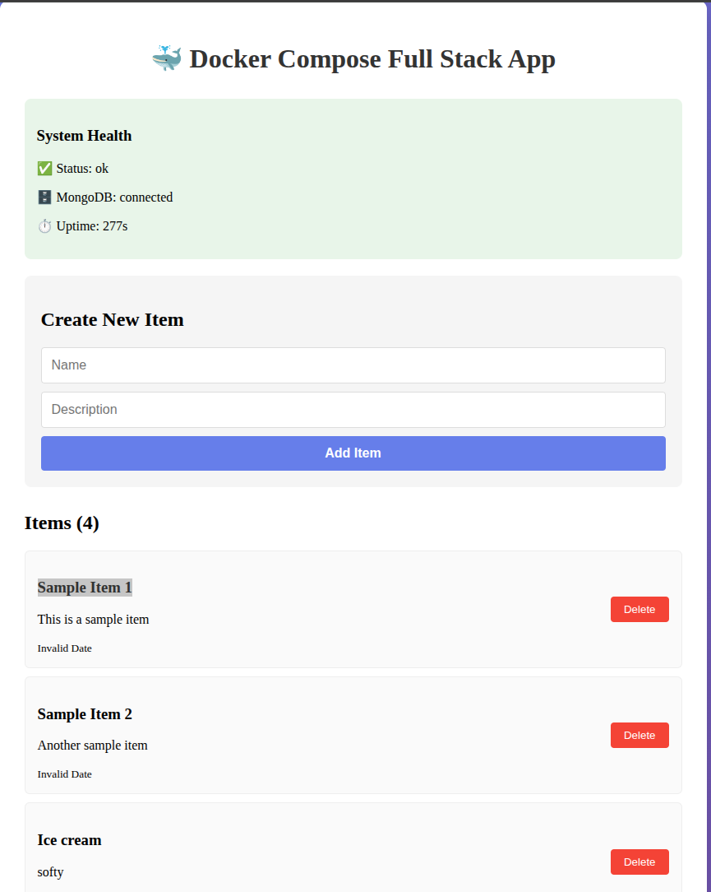

### Screenshot 1
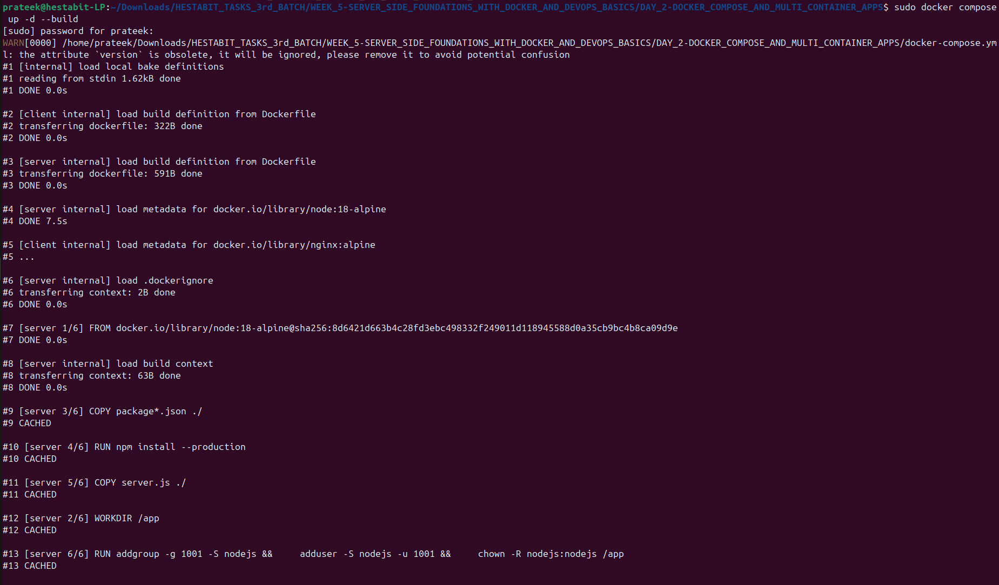

### Screenshot 2
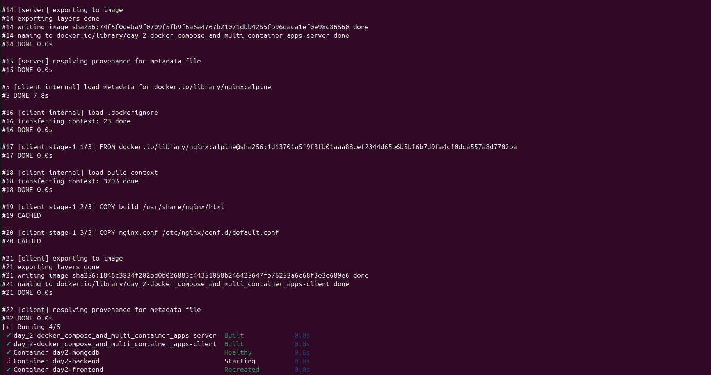

### Screenshot 3
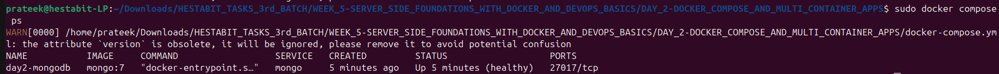

### Screenshot 4
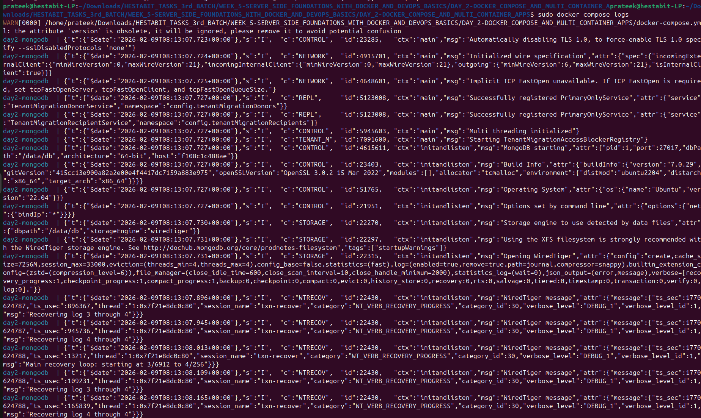

### Screenshot 5
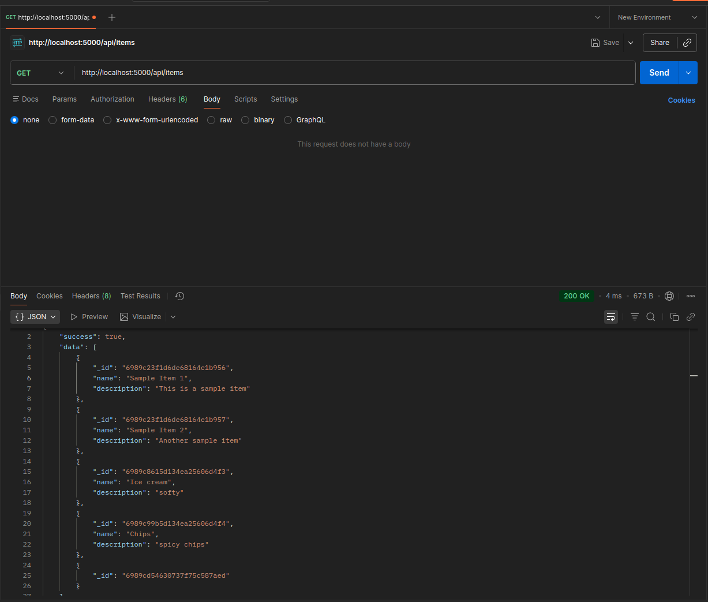

### Screenshot 6
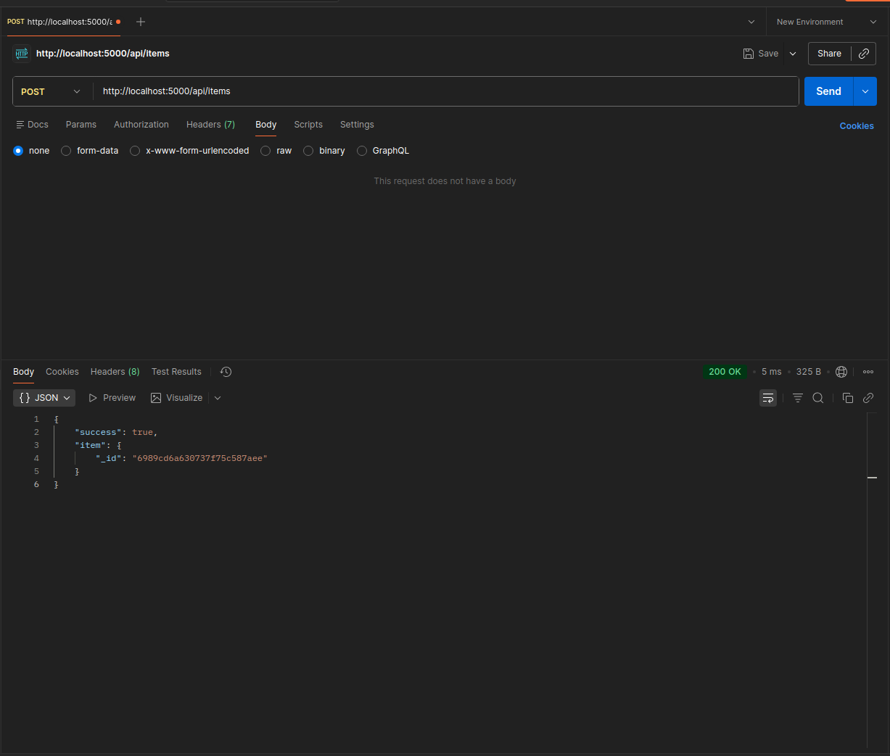

### Screenshot 7
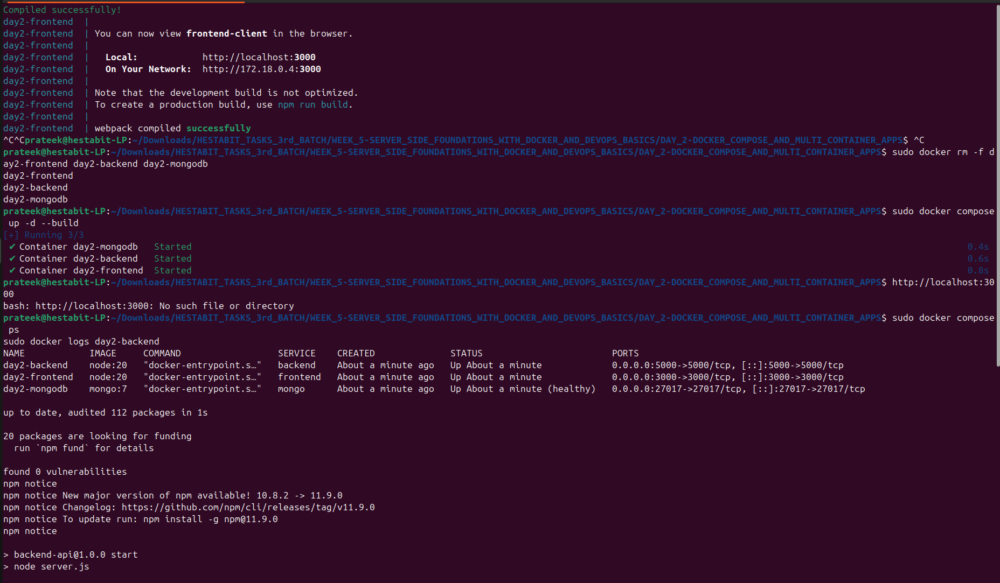

### Screenshot 8
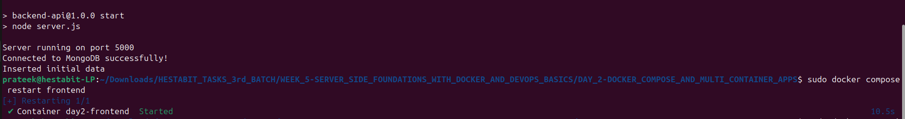

### Screenshot 9
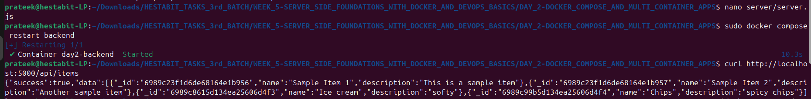

### Screenshot 10
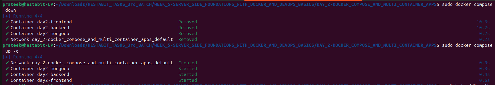

### Screenshot 11
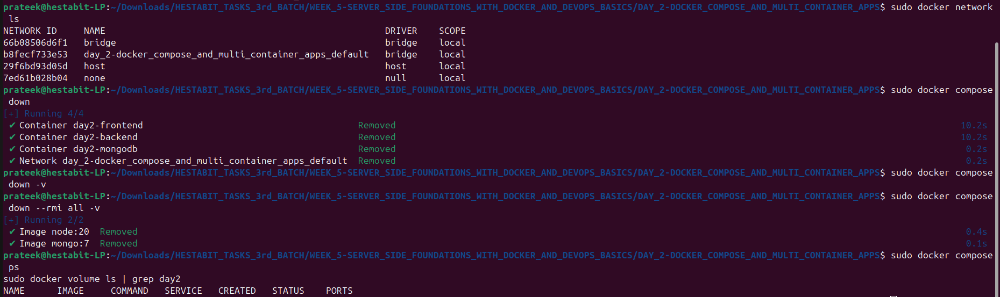

### Screenshot 12
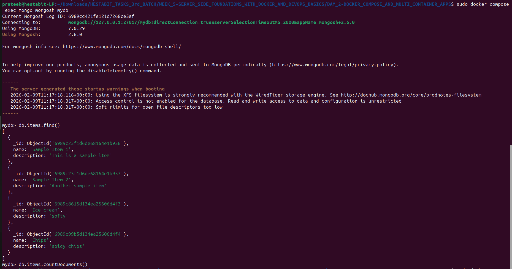

---

## ✅ Deliverables

- [x] `docker-compose.yml` — Full-stack multi-container orchestration
- [x] `service-architecture.md` — Service architecture documentation
- [x] Server connects MongoDB via container networking (`mongo:27017`)
- [x] Logs exposed via `docker compose logs`
- [x] MongoDB volume mapped for data persistence
- [x] 13 screenshots including full-stack app running

---

## 💡 Key Learnings

- **Container networking:** Services communicate via container names — `server` connects to MongoDB using `mongodb://mongo:27017` not `localhost`
- **`depends_on`:** Ensures services start in the correct order (server waits for mongo, client waits for server)
- **Named volumes:** `mongo-data:/data/db` persists database data even after `docker compose down`
- **Single command deployment:** `docker compose up -d` spins up the entire stack — no manual setup needed
- **Service isolation:** Each service runs in its own container with its own filesystem and network interface
