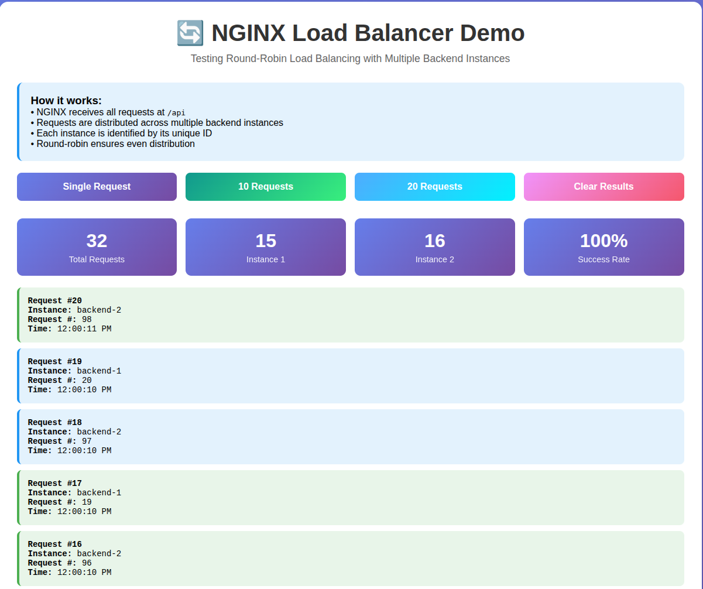
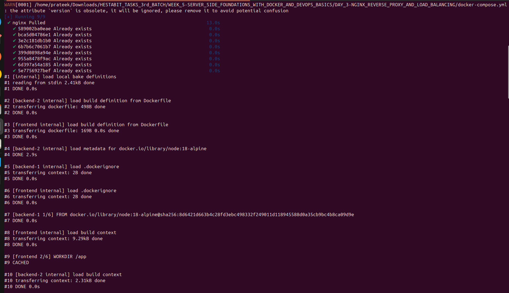
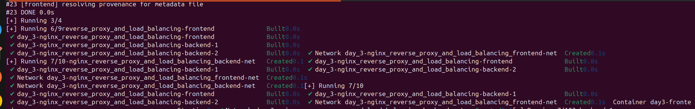
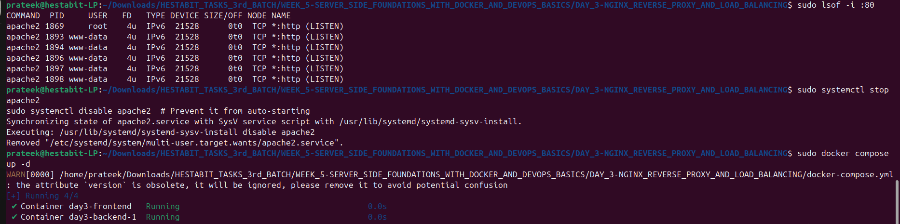
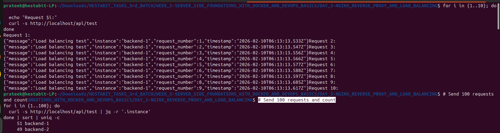
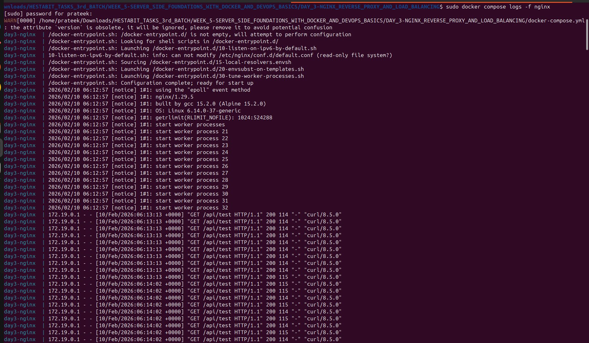
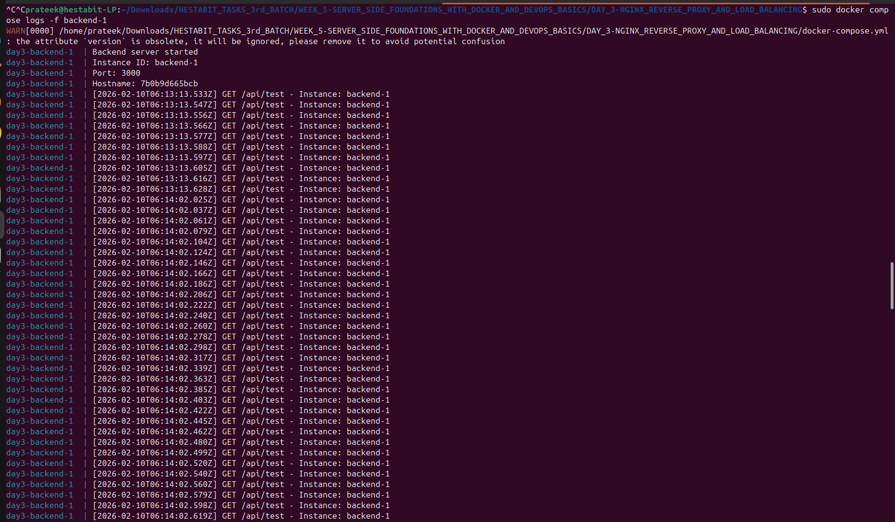
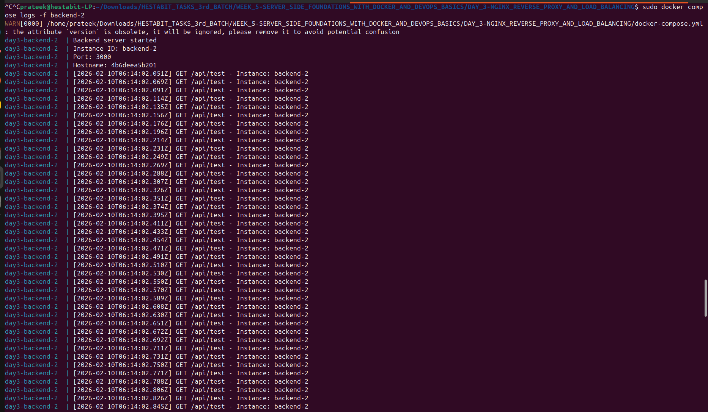
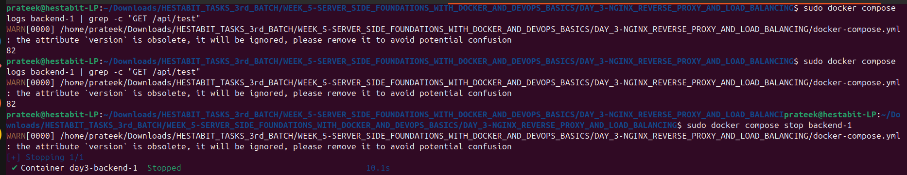
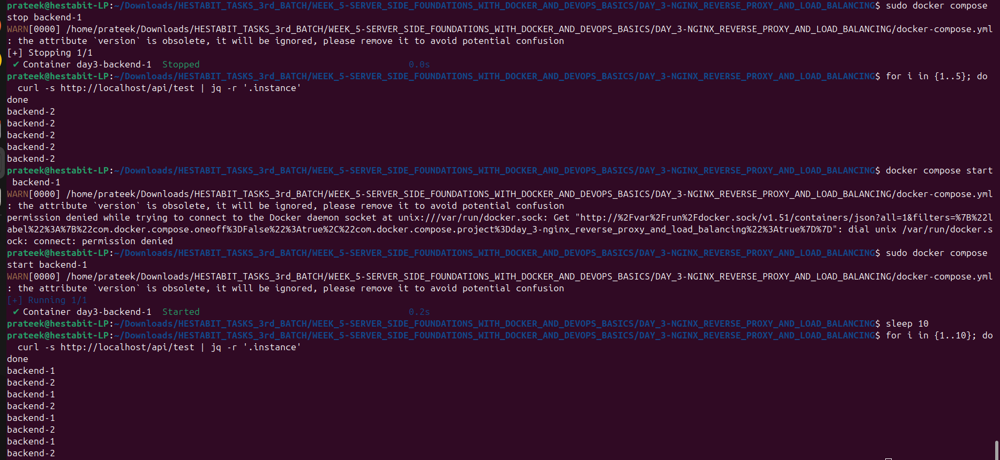

# Week 5 — Day 3: NGINX Reverse Proxy + Load Balancing

## 🎯 Objective
Set up NGINX inside Docker as a reverse proxy routing traffic to backend containers, and simulate round-robin load balancing across multiple backend replicas.

---

## 📚 Topics Covered

- NGINX inside Docker as a reverse proxy
- Routing `/api` traffic to internal backend containers
- Running multiple backend replicas
- Round-robin load balancing simulation
- NGINX upstream configuration

---

## 🧪 Exercise

Ran two instances of the Node.js backend and configured an NGINX container as a reverse proxy to distribute incoming `/api` requests across both instances using round-robin load balancing.

---

## 📁 Folder Structure

```
DAY_3-NGINX_REVERSE_PROXY_AND_LOAD_BALANCING/
├── reverse-proxy-readme.md     # Reverse proxy setup documentation
└── SCREENSHOTS/
    ├── NGINX_LOAD_BALANCER_DEMO.png
    ├── SCREENSHOT_1.png
    ├── SCREENSHOT_2.png
    ├── SCREENSHOT_3.png
    ├── SCREENSHOT_4.png
    ├── SCREENSHOT_5.png
    ├── SCREENSHOT_6.png
    ├── SCREENSHOT_7.png
    ├── SCREENSHOT_8.png
    └── SCREENSHOT_9.png
```

---

## ⚙️ NGINX Configuration (`nginx.conf`)

```nginx
upstream backend {
  server backend-1:3000;
  server backend-2:3000;
}

server {
  listen 80;

  location /api {
    proxy_pass http://backend;
    proxy_set_header Host $host;
    proxy_set_header X-Real-IP $remote_addr;
  }
}
```

---

## 🐳 Docker Compose Setup

```yaml
version: "3.8"
services:
  nginx:
    image: nginx:alpine
    ports:
      - "80:80"
    volumes:
      - ./nginx.conf:/etc/nginx/nginx.conf
    depends_on:
      - backend-1
      - backend-2

  backend-1:
    build: ./server
    container_name: backend-1

  backend-2:
    build: ./server
    container_name: backend-2
```

---

## 🔧 Key Commands Used

```bash
# Start all services
docker compose up -d

# Scale backend to 2 replicas
docker compose up -d --scale backend=2

# Test load balancing (watch alternating backend IDs)
curl http://localhost/api/health
curl http://localhost/api/health

# Check NGINX logs
docker compose logs nginx

# Reload NGINX config without downtime
docker exec nginx-container nginx -s reload
```

---

## 🌐 Request Flow

```
Client Request
     ↓
NGINX :80  (reverse proxy)
     ↓
/api → upstream backend (round-robin)
     ├── backend-1:3000
     └── backend-2:3000
```

---

## 📸 Screenshots

### NGINX Load Balancer Demo


### Screenshot 1


### Screenshot 2


### Screenshot 3


### Screenshot 4


### Screenshot 5


### Screenshot 6


### Screenshot 7


### Screenshot 8


### Screenshot 9


---

## ✅ Deliverables

- [x] `nginx.conf` — Reverse proxy with round-robin upstream config
- [x] `reverse-proxy-readme.md` — Setup and configuration documentation
- [x] Two backend instances running behind NGINX
- [x] Round-robin load balancing verified
- [x] 10 screenshots including load balancer demo

---

## 💡 Key Learnings

- **Reverse proxy:** NGINX sits in front of all backends — clients never talk directly to Node.js servers
- **Upstream block:** Defines the pool of backend servers NGINX distributes traffic across
- **Round-robin (default):** NGINX alternates requests across all upstream servers equally — no config needed beyond listing them
- **Container names as hostnames:** In Docker networks, `backend-1` and `backend-2` resolve as hostnames automatically
- **Zero-downtime reload:** `nginx -s reload` applies config changes without dropping existing connections

