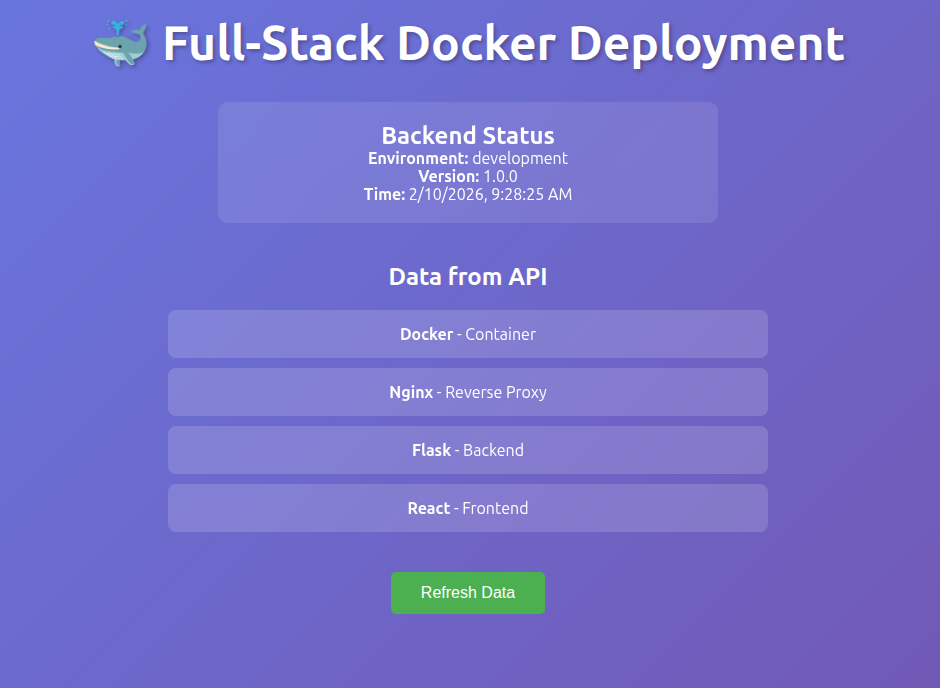
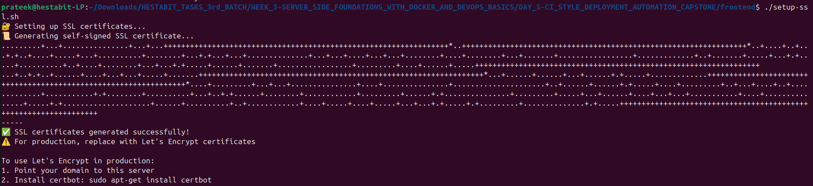
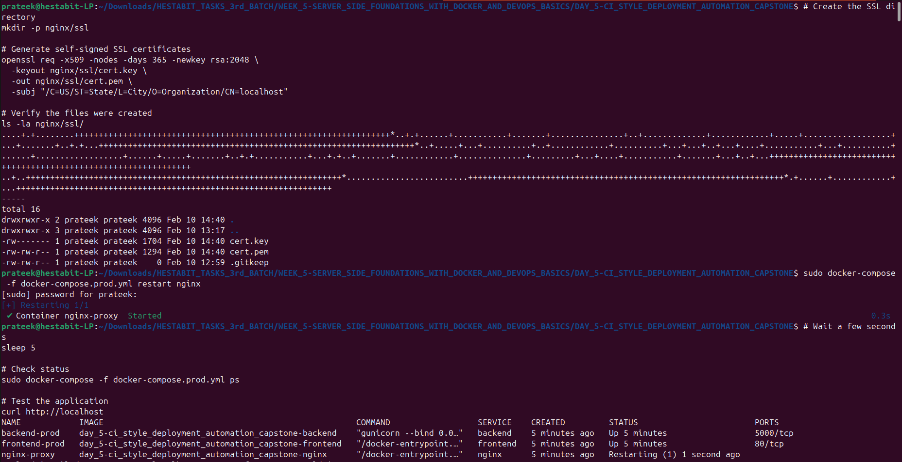
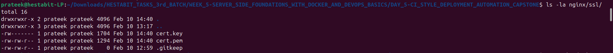
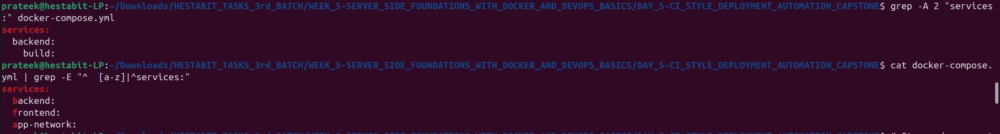
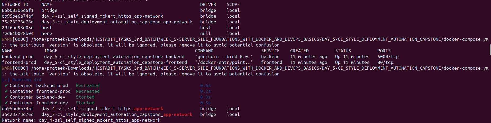
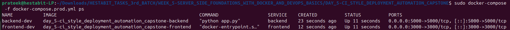
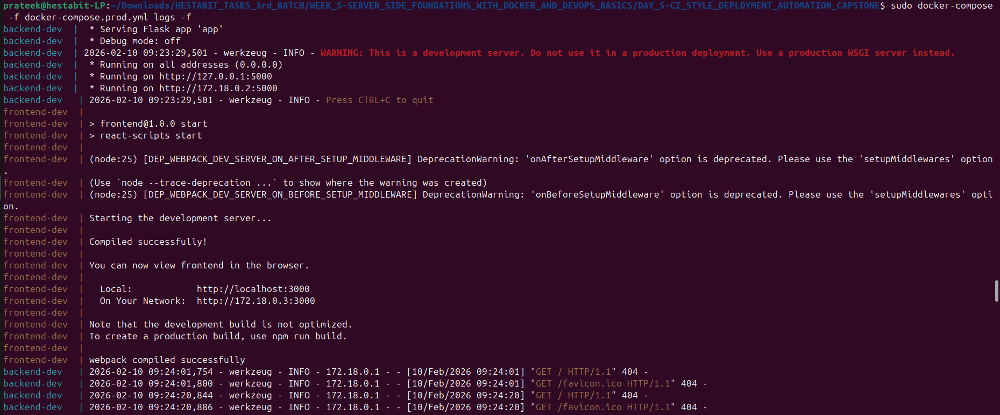
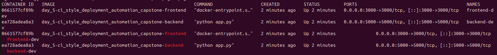
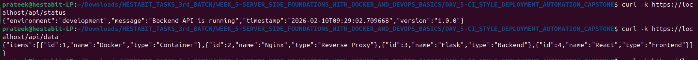

# Week 5 — Day 5: CI-Style Deployment Automation + Capstone

## 🎯 Objective
Deploy a complete full-stack application in Docker with reverse proxy, HTTPS, health checks, secrets management, log rotation, and a production-ready compose configuration.

---

## 📚 Topics Covered

- Docker volumes and compose profiles
- `.env` config for secrets (never committed)
- Log rotation inside containers
- Health checks in Docker Compose
- Container restart policies
- Production-grade `docker-compose.prod.yml`
- Deployment automation script

---

## 🧪 Capstone

Deployed a full-stack app stack combining everything from Week 5 — React client, Node.js server, MongoDB, NGINX reverse proxy with HTTPS, health checks, restart policies, and secrets via `.env`.

---

## 📁 Folder Structure

```
DAY_5-CI_STYLE_DEPLOYMENT_AUTOMATION_CAPSTONE/
├── production-guide.md         # Full production deployment guide
└── SCREENSHOTS/
    ├── FULLSTACK_DOCKER_DEPLOYMENT_APP.png
    ├── SCREENSHOT_1.png
    ├── SCREENSHOT_2.png
    ├── SCREENSHOT_3.png
    ├── SCREENSHOT_4.png
    ├── SCREENSHOT_5.png
    ├── SCREENSHOT_6.png
    ├── SCREENSHOT_7.png
    ├── SCREENSHOT_8.png
    └── SCREENSHOT_9.png
```

---

## 🐳 Production Compose (`docker-compose.prod.yml`)

```yaml
version: "3.8"
services:
  nginx:
    image: nginx:alpine
    ports:
      - "80:80"
      - "443:443"
    volumes:
      - ./nginx.conf:/etc/nginx/nginx.conf
      - ./certs:/etc/nginx/certs
    restart: always
    depends_on:
      server:
        condition: service_healthy

  server:
    build: ./server
    env_file: .env
    restart: always
    healthcheck:
      test: ["CMD", "curl", "-f", "http://localhost:3000/health"]
      interval: 30s
      timeout: 10s
      retries: 3
    logging:
      driver: "json-file"
      options:
        max-size: "10m"
        max-file: "3"
    depends_on:
      mongo:
        condition: service_healthy

  mongo:
    image: mongo:6
    env_file: .env
    restart: always
    volumes:
      - mongo-data:/data/db
    healthcheck:
      test: ["CMD", "mongosh", "--eval", "db.adminCommand('ping')"]
      interval: 30s
      timeout: 10s
      retries: 3

  client:
    build: ./client
    restart: always

volumes:
  mongo-data:
```

---

## 🔐 `.env.example`

```env
# MongoDB
MONGO_URI=mongodb://mongo:27017/mydb
MONGO_INITDB_ROOT_USERNAME=admin
MONGO_INITDB_ROOT_PASSWORD=secret

# App
PORT=3000
JWT_SECRET=your_jwt_secret_here
NODE_ENV=production
```

> ⚠️ Never commit `.env` — only commit `.env.example`

---

## 🚀 Deployment Script (`deploy.sh`)

```bash
#!/bin/bash
set -e

echo "Pulling latest images..."
docker compose -f docker-compose.prod.yml pull

echo "Starting stack..."
docker compose -f docker-compose.prod.yml up -d --build

echo "Checking health..."
docker compose -f docker-compose.prod.yml ps

echo "✅ Deployment complete!"
```

---

## ✅ Production Checklist

| Item | Status |
|------|--------|
| `docker-compose.prod.yml` | ✅ |
| Secrets in `.env` (not committed) | ✅ |
| Health checks on server + mongo | ✅ |
| Container restart policy (`always`) | ✅ |
| Log rotation (`max-size: 10m`) | ✅ |
| NGINX reverse proxy + HTTPS | ✅ |
| Deployment script (`deploy.sh`) | ✅ |

---

## 📸 Screenshots

### 🚀 Full Stack Docker Deployment


### Screenshot 1


### Screenshot 2


### Screenshot 3


### Screenshot 4


### Screenshot 5


### Screenshot 6


### Screenshot 7


### Screenshot 8


### Screenshot 9


---

## ✅ Deliverables

- [x] `docker-compose.prod.yml` — Production compose with health checks and restart policies
- [x] `.env.example` — Secrets template (actual `.env` not committed)
- [x] Health checks configured on server and MongoDB services
- [x] Container restart policy set to `always`
- [x] Log rotation configured (`max-size: 10m`, `max-file: 3`)
- [x] `production-guide.md` — Full deployment documentation
- [x] `deploy.sh` — Automated deployment script
- [x] 10 screenshots including full-stack deployment proof

---

## 💡 Key Learnings

- **`restart: always`:** Container automatically restarts on crash or server reboot — essential for production uptime
- **Health checks:** Docker waits for `service_healthy` before starting dependent services — prevents race conditions on startup
- **Log rotation:** `max-size` and `max-file` prevent containers from filling up disk with unbounded logs
- **`.env` secrets:** Never hardcode credentials — `.env` is gitignored, `.env.example` documents required variables
- **`docker compose -f`:** Specify a different compose file for prod vs dev — keeps configs clean and environment-specific
- **Deployment script:** Wrapping compose commands in a script makes deployments one-command, repeatable, and CI/CD ready
